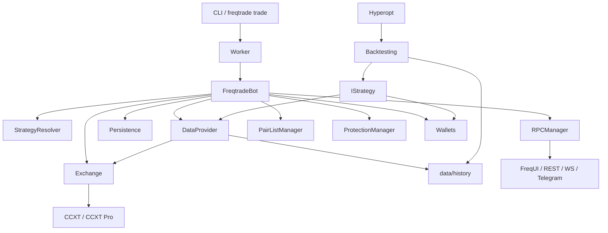
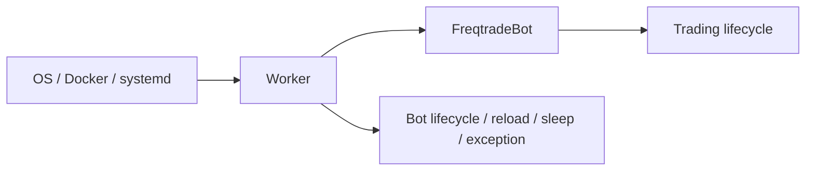
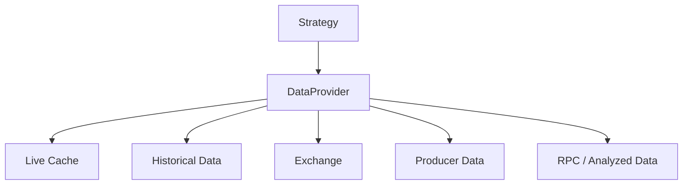
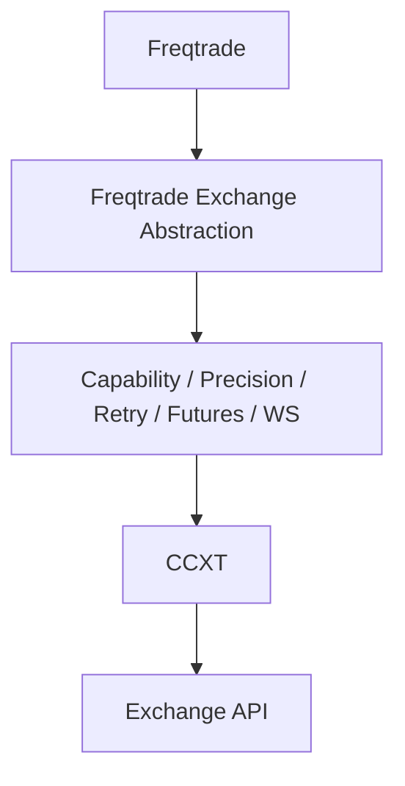
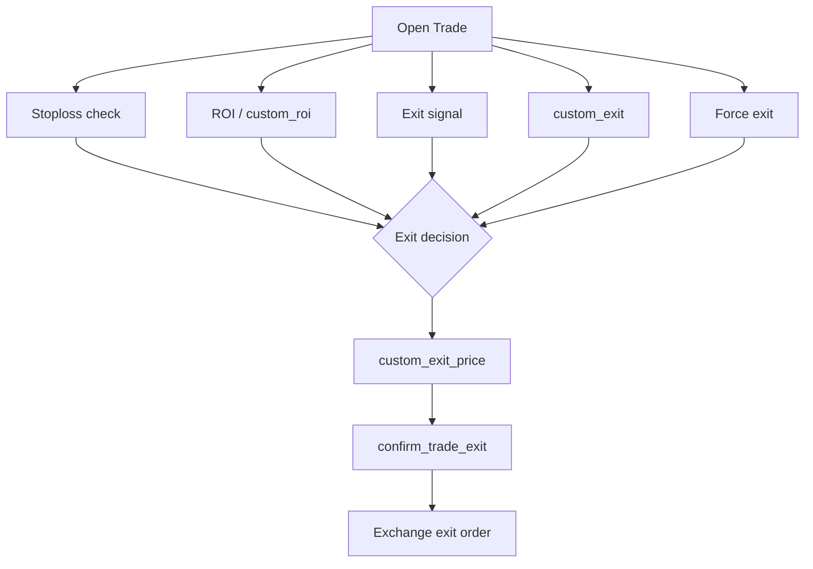
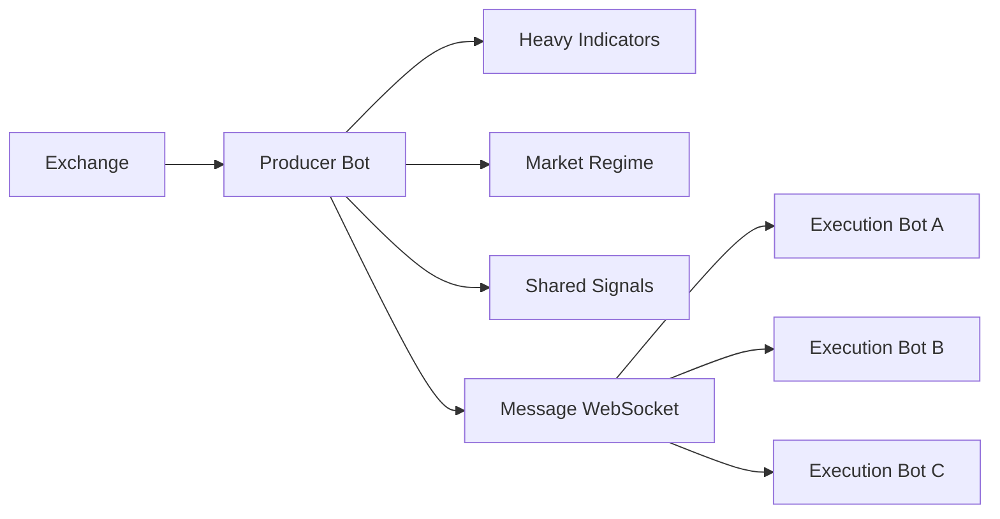
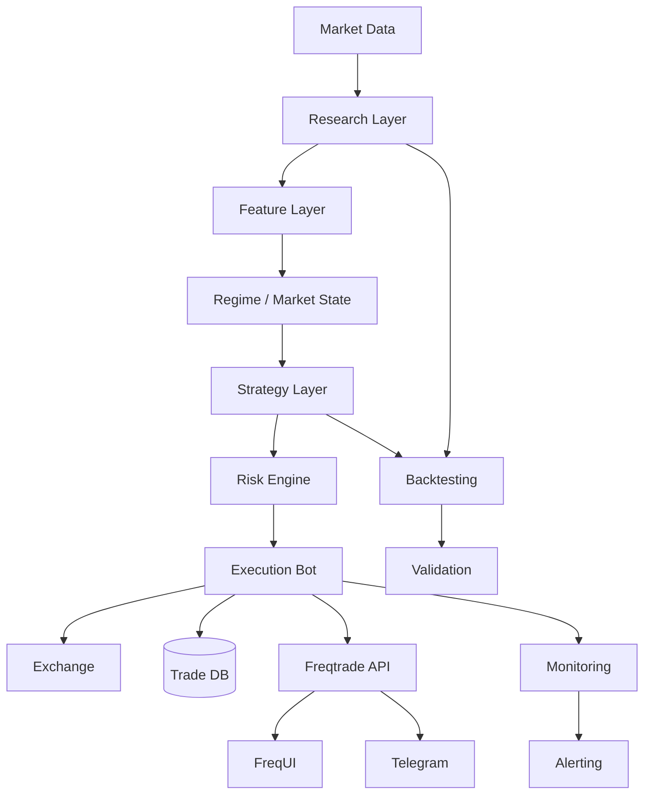
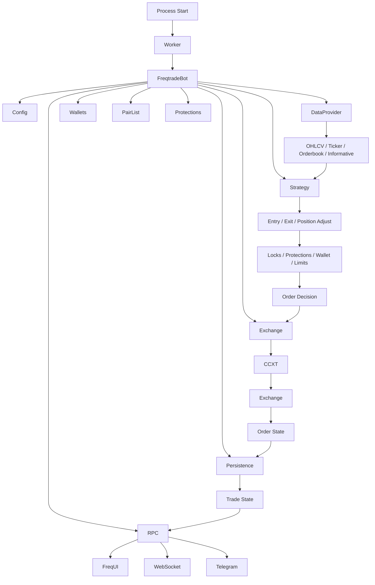

# Freqtrade 源码级深入教程·第二卷
## 从“会用框架”到“理解框架”：把 Freqtrade 的黑盒逐层拆开

> 本卷是第一版《Freqtrade 全栈架构与实盘部署超级教程》的深度扩展，目标是让你能够：
>
> 1. 顺着源码追踪一次交易从启动到成交再到落库的完整调用链；
> 2. 理解 `Worker / FreqtradeBot / Strategy / DataProvider / Exchange / Persistence / RPC` 的职责边界；
> 3. 知道一个 Strategy 方法“什么时候被调用、被谁调用、传入什么、输出去哪里”；
> 4. 理解回测与实盘为什么共享策略接口，却不是同一套执行路径；
> 5. 设计真正可扩展的多周期、多策略、多 bot、Producer/Consumer 架构；
> 6. 用日志、源码、数据库和 API 反向定位实盘问题，而不是“猜”。

> **版本基线**
>
> 本卷以 2026.x / 当前 `develop` 源码结构为主要参考，并特别关注 2026.7 这一发布线。生产部署时请以你的实际镜像 tag、`freqtrade -V`、Git commit 和对应版本文档为准。
>
> 官方仓库目前可见的 2026.x 发布线与最新开发内容仍在持续变化，因此本文把“稳定概念”和“具体实现”分开写：前者可以长期保留，后者应在升级时重新对照源码。

---

# 目录

- [17. 源码目录地图：先学会在哪里找答案](#17-源码目录地图先学会在哪里找答案)
- [18. Bot 从进程启动到第一次下单：完整调用链](#18-bot-从进程启动到第一次下单完整调用链)
- [19. Worker 与 FreqtradeBot：为什么要分两层](#19-worker-与-freqtradebot为什么要分两层)
- [20. Strategy 生命周期：一个策略对象到底经历了什么](#20-strategy-生命周期一个策略对象到底经历了什么)
- [21. DataProvider：数据为什么不是简单的 DataFrame](#21-dataprovider数据为什么不是简单的-dataframe)
- [22. 多周期的源码级理解：merge、ffill 与时间因果](#22-多周期的源码级理解mergeffill-与时间因果)
- [23. Exchange 层：Freqtrade 与 CCXT 之间到底隔了什么](#23-exchange-层freqtrade-与-ccxt-之间到底隔了什么)
- [24. Order 与 Trade：数据库里的“交易”不是一个对象](#24-order-与-trade数据库里的交易不是一个对象)
- [25. 一次入场的完整因果链：从 signal 到 exchange order](#25-一次入场的完整因果链从-signal-到-exchange-order)
- [26. 一次退出的完整因果链：ROI、stoploss、signal、custom_exit 谁赢](#26-一次退出的完整因果链roi-stoplosssignalcustom_exit-谁赢)
- [27. Callback 深水区：哪些函数容易产生重复下单与隐藏副作用](#27-callback-深水区哪些函数容易产生重复下单与隐藏副作用)
- [28. 回测内部：为什么回测不是“把实盘重放一次”](#28-回测内部为什么回测不是把实盘重放一次)
- [29. Hyperopt 内部：参数优化到底在优化什么](#29-hyperopt-内部参数优化到底在优化什么)
- [30. FreqUI / REST / WebSocket / RPC：UI 为什么不是简单网页](#30-frequiirestwebsocketrpcui-为什么不是简单网页)
- [31. 多 Bot：一个 Web UI 怎样管理多个独立机器人](#31-多-bot一个-web-ui-怎样管理多个独立机器人)
- [32. Producer / Consumer：为什么它适合做“研究计算层 + 执行层”](#32-producer--consumer为什么它适合做研究计算层--执行层)
- [33. 彻底避免 Lookahead Bias：从时间索引到合并方式逐层检查](#33-彻底避免-lookahead-bias从时间索引到合并方式逐层检查)
- [34. 实盘 Debug 方法论：从现象反向定位源码层](#34-实盘-debug-方法论从现象反向定位源码层)
- [35. 生产级工程结构：策略不再是一个巨大 py 文件](#35-生产级工程结构策略不再是一个巨大-py-文件)
- [36. 一个适合长期主力使用的 Freqtrade 技术栈](#36-一个适合长期主力使用的-freqtrade-技术栈)
- [37. 源码学习路径：怎样真正做到“没有黑盒”](#37-源码学习路径怎样真正做到没有黑盒)
- [38. 关键源码与官方资料索引](#38-关键源码与官方资料索引)

---

# 17. 源码目录地图：先学会在哪里找答案

如果你准备长期把 Freqtrade 当成主力框架，最重要的能力不是记住 API，而是形成一个“问题 → 源码目录”的映射。

## 17.1 推荐先记住这些目录

```text
freqtrade/
├── configuration/          # 配置解析、校验、命令行参数
├── data/
│   ├── dataprovider.py     # 策略访问数据的核心门面
│   ├── history/            # 历史数据下载、读取、转换
│   └── converters/         # OHLCV / trade / orderbook 等数据转换
├── exchange/
│   ├── exchange.py         # 交易所抽象层，封装 CCXT
│   ├── exchange_ws.py      # WebSocket 相关
│   └── exchange_utils_*    # 时间周期、精度、价格数量等工具
├── freqtradebot.py         # 实盘交易核心
├── worker.py               # 进程级 Worker / loop / lifecycle
├── strategy/
│   ├── interface.py        # IStrategy 主接口
│   ├── strategy_wrapper.py # callback 安全包装
│   └── informative_decorator.py
├── resolvers/
│   ├── strategy_resolver.py
│   ├── exchange_resolver.py
│   └── iresolver.py
├── persistence/
│   ├── trade_model.py      # Trade / Order 等持久化模型
│   ├── base.py             # ORM / session
│   └── migrations.py       # 数据库迁移
├── plugins/
│   ├── pairlistmanager.py
│   ├── protectionmanager.py
│   └── pairlist/
├── wallets/                # 余额、可用 stake 等
├── rpc/
│   ├── api_server/
│   ├── manager.py
│   ├── telegram.py
│   └── ...
├── optimize/
│   ├── backtesting.py
│   └── hyperopt_*.py
├── freqai/                 # 如果使用 FreqAI
└── enums.py / constants.py / util.py / misc.py
```

这张图非常重要：



## 17.2 一个非常实用的源码定位方法

以后你遇到问题，不要直接搜索整个仓库。

例如：

> “为什么 `populate_indicators()` 没按我预期每 5 秒调用？”

先查：

```text
bot-basics / execution logic
        ↓
FreqtradeBot 主循环
        ↓
strategy.analyze(...)
        ↓
IStrategy.analyze()
        ↓
populate_indicators()
```

再看缓存逻辑。

再例如：

> “为什么我把 `informative pair` 加进去了，但 callback 里拿不到？”

路径应该是：

```text
Strategy.gather_informative_pairs()
        ↓
DataProvider.refresh()
        ↓
informative dataframe
        ↓
merge_informative_pair / @informative
        ↓
strategy dataframe
```

而不是直接去看 UI。

---

# 18. Bot 从进程启动到第一次下单：完整调用链

这一节是整个第二卷的核心。

## 18.1 先记住三个层级

```text
操作系统进程
    ↓
Worker
    ↓
FreqtradeBot
    ↓
Strategy / Exchange / DataProvider / Persistence / RPC ...
```

### Worker

负责更上层的生命周期：

- 进程启动；
- 创建 / 销毁 Bot；
- 处理 reload；
- 主循环调度；
- 运行间隔；
- 异常与退出；
- 配合 systemd / docker 等运行环境。

### FreqtradeBot

负责“真正的交易业务”：

- 读取 open trades；
- pairlist；
- 拉数据；
- strategy analysis；
- 订单状态；
- exit；
- position adjustment；
- entry；
- RPC 消息；
- persistence commit。

### Strategy

负责：

> “如果市场数据是这样，那么交易决策是什么？”

这三层边界一定不要打乱。

---

## 18.2 启动时到底发生了什么

当前 `FreqtradeBot.__init__()` 的实现会初始化多项核心对象，包括：

- Exchange；
- Strategy；
- 数据库；
- Wallets；
- RPCManager；
- DataProvider；
- PairListManager；
- Strategy 上挂接 DataProvider；
- Strategy 上挂接 Wallets；
- 初始 whitelist；
- initial state。

源码中可以直接看到类似以下顺序：

```python
self.exchange = ExchangeResolver.load_exchange(...)
self.strategy = StrategyResolver.load_strategy(...)
init_db(...)
self.wallets = Wallets(...)
self.rpc = RPCManager(self)
self.dataprovider = DataProvider(...)
self.pairlists = PairListManager(...)
self.dataprovider.add_pairlisthandler(self.pairlists)

self.strategy.dp = self.dataprovider
self.strategy.wallets = self.wallets
```

### 这意味着一个非常重要的事实

你的 Strategy 不是“独立脚本”。

它实际上是一个被框架实例化并注入依赖的对象：

```text
Strategy
 ├── config
 ├── dp
 ├── wallets
 ├── 参数 / strategy settings
 └── callbacks
```

所以你在策略里使用：

```python
self.dp
self.wallets
self.config
```

本质上是在访问 Bot 注入给你的运行时对象。

---

## 18.3 第一次循环

实盘 / dry-run 的循环可以抽象成：

```text
Worker
  ↓
FreqtradeBot.process()
  ↓
读取 open trades
  ↓
刷新 pairlist
  ↓
DataProvider.refresh()
  ↓
bot_loop_start()
  ↓
strategy.analyze()
  ↓
检查已有订单
  ↓
检查 open trades 的退出条件
  ↓
position adjustment
  ↓
检查新的 entry
  ↓
RPC message queue
  ↓
commit
  ↓
下一轮
```

官方 execution logic 也将实盘循环描述为这个核心顺序：先恢复状态与 pairlist，再刷新 OHLCV / informative data，再执行 `bot_loop_start()`，然后分析策略，更新订单，处理退出，再处理仓位调整和新入场。  
来源：[Freqtrade Basics](https://docs.freqtrade.io/en/latest/bot-basics/)

---

# 19. Worker 与 FreqtradeBot：为什么要分两层

## 19.1 如果只有一个类，会发生什么

假设一切都写进：

```python
class FreqtradeBot:
    def run(self):
        ...
```

那么：

- 重载；
- 宕机恢复；
- loop interval；
- bot state；
- process lifecycle；
- 业务逻辑；

都会揉成一个巨大的对象。

工程上非常难维护。

---

## 19.2 Worker 的本质

可以把 Worker 理解为：

> “Bot runtime supervisor”

而 FreqtradeBot 可以理解为：

> “Trading domain service”

抽象关系：



这样设计的好处是：

### Runtime concern

例如：

```text
restart
reload
stop
shutdown
exception
throttle
```

不需要污染交易逻辑。

### Trading concern

例如：

```text
entry
exit
stoploss
order management
position adjustment
```

不需要知道 Docker/systemd 的细节。

---

# 20. Strategy 生命周期：一个策略对象到底经历了什么

## 20.1 Strategy 不是“被调用一次”

很多初学者的心理模型是：

```text
dataframe
 ↓
populate_indicators()
 ↓
populate_entry_trend()
 ↓
return
```

这是错的。

真正的 Strategy 生命周期是：

```text
实例化
 ↓
配置注入
 ↓
DataProvider 注入
 ↓
Wallet 注入
 ↓
bot_start()
 ↓
循环
    ↓
    bot_loop_start()
    ↓
    populate_indicators()
    ↓
    populate_entry_trend()
    ↓
    populate_exit_trend()
    ↓
    callback 若干次
    ↓
重复
```

---

## 20.2 `bot_start()` 是“实例级初始化”

官方文档说明：

> `bot_start()` 在 bot 初始化之后、DataProvider 和 Wallet 已设置后调用一次。

非常适合：

```python
def bot_start(self, **kwargs):
    self.model = load_model(...)
    self.reference_data = ...
    self.runtime_cache = {}
```

不适合：

```python
def bot_start(self, **kwargs):
    # 每个 pair 都要做的事情
```

因为它只执行一次。

---

## 20.3 `bot_loop_start()` 是“循环级初始化”

它大约每个 live/dry-run throttle iteration 调用一次；回测 / hyperopt 则按其执行逻辑调用。

适合：

- 外部宏观数据；
- BTC 市场 regime；
- 全局 volatility；
- 外部 API 数据；
- pair-independent 特征；
- 每一轮只算一次的全局状态。

不适合：

```python
for pair in whitelist:
    requests.get(...)
```

因为这会把网络调用放进 pair 级执行中。

更合理：

```python
def bot_loop_start(self, current_time, **kwargs):
    self.global_state = fetch_global_state()
```

然后：

```python
def populate_entry_trend(self, dataframe, metadata):
    pair = metadata["pair"]
    state = self.global_state
    ...
```

---

# 21. DataProvider：数据为什么不是简单的 DataFrame

DataProvider 是理解 Freqtrade 的关键。

当前源码将它定义为：

> Responsible to provide data to the bot, including ticker, orderbook, live/historical OHLCV, and a common interface for bot and strategy.

换句话说：

```text
Strategy 不直接管理“数据获取”
Strategy 请求 DataProvider
DataProvider 再决定从哪里拿
```

---

## 21.1 DataProvider 的抽象层次

可以这样理解：



当前实现中确实存在：

- cached pairs；
- backtesting data；
- producer pairs；
- message queue；
- exchange reference；
- RPC reference。

也就是说 DataProvider 已经不是简单的“工具类”，而是一个数据路由层。

---

## 21.2 `self.dp.current_whitelist()`

它表达的是：

> “Bot 当前认为可交易的动态 pair 列表是什么？”

不是：

> “我 config 中写了什么 pair。”

因为 Pairlist 可能动态变化。

---

## 21.3 `self.dp.get_pair_dataframe()`

可以理解为：

```text
pair + timeframe + candle_type
        ↓
DataProvider
        ↓
DataFrame
```

例如：

```python
data_1h = self.dp.get_pair_dataframe(
    pair="BTC/USDT",
    timeframe="1h",
)
```

这背后的关键思想是：

> 你请求的是一个“数据视图”，不是自己去访问交易所。

这样可以让框架统一管理：

- cache；
- 回测；
- dry-run；
- live；
- informative；
- producer/consumer。

---

# 22. 多周期的源码级理解：merge、ffill 与时间因果

多周期最容易写错。

例如：

```text
主周期 = 5m
高周期 = 1h
```

问题不是：

> “怎样把 1h dataframe merge 到 5m？”

真正的问题是：

> “5m 的每一根 K 线，在当时这个时点究竟允许知道哪一个 1h 信息？”

---

## 22.1 正确的因果模型

假设 1h candle：

```text
10:00 ───────── 10:59
```

那么在：

```text
10:20
```

你不可能知道完整的：

```text
10:00-10:59 close
```

因为 candle 尚未完成。

所以如果使用高周期 `close`：

```text
5m @ 10:20
```

不能偷看：

```text
1h @ 10:00 的最终 close
```

这就是典型 lookahead。

---

## 22.2 `merge_informative_pair()` 在解决什么

核心目的不是“方便拼列”。

它主要解决：

- 时间对齐；
- 列名；
- informative timeframe；
- 前移避免直接窥视未结束 candle；
- ffill；
- 多 pair/multiple timeframe 数据融合。

因此：

```python
dataframe = merge_informative_pair(
    dataframe,
    informative,
    self.timeframe,
    informative_timeframe,
    ffill=True,
)
```

真正应该思考的是：

```text
“这一次 merge 后，主周期每行到底对应 informative 的哪一根已经可知 candle？”
```

---

## 22.3 `@informative()` 的边界

官方文档明确指出：

- 被 `@informative` 装饰的方法各自独立运行；
- 一个 informative 方法默认不能直接依赖另一个 informative pair；
- informative dataframe 最终会合并给主 `populate_indicators()`。

因此：

```python
@informative("1h")
def populate_indicators_1h(...):
    ...

@informative("4h")
def populate_indicators_4h(...):
    ...
```

两个函数不要假设：

```python
1h → 4h → 主周期
```

存在天然依赖。

如果需要这种依赖，应考虑手动 DataProvider / merge。

来源：[Strategy customization](https://docs.freqtrade.io/en/latest/strategy-customization/)

---

# 23. Exchange 层：Freqtrade 与 CCXT 之间到底隔了什么

Freqtrade 不是直接把：

```python
ccxt.binance(...)
```

塞进策略里。

它在 CCXT 上再封装了一层 Exchange。

---

## 23.1 为什么一定需要这一层

因为单纯 CCXT 解决不了 Freqtrade 的全部需求。

Freqtrade 还需要：

- market refresh；
- precision；
- amount conversion；
- contract size；
- futures；
- leverage tiers；
- funding；
- stoploss；
- dry-run；
- websocket；
- price calculation；
- retry；
- exception mapping；
- exchange-specific capability flags。

当前 `Exchange` 实现同时持有：

```python
self._api        # CCXT sync
self._api_async  # CCXT async / pro
self._ws_async   # websocket if available
```

并维护市场缓存、trading fees、leverage tiers 等状态。

这就是为什么 Strategy 中不应该直接操作 CCXT。

---

## 23.2 Exchange 的核心设计思想



Freqtrade 通过自己的 Exchange abstraction 把：

```text
“交易所差异”
```

压缩在边界层。

所以策略只需要理解：

```python
self.dp
self.exchange
```

而不需要在交易逻辑里不断：

```python
if exchange == "binance":
    ...
elif exchange == "bybit":
    ...
```

当然，真正的 exchange-specific feature 仍可能需要配置或特判。

---

# 24. Order 与 Trade：数据库里的“交易”不是一个对象

这是理解实盘恢复的核心。

## 24.1 `Trade`

可以理解为：

> 一个逻辑上的持仓生命周期。

例如：

```text
BTC/USDT
Entry: 60000
Stake: 1000
Current amount: ...
Exit: 61000
Profit: ...
```

它描述：

```text
“这个仓位”
```

---

## 24.2 `Order`

Order 描述：

> 这个仓位为了执行而产生的具体交易所订单。

一个 Trade 可以有多个 Orders。

例如：

```text
Trade #1001
   ├── Entry Order #A
   ├── Entry Order #B   ← adjustment / re-entry
   ├── Stoploss Order
   ├── Partial Exit #C
   └── Final Exit #D
```

当前源码明确建模为：

> One Trade can have many Orders  
> One Order can only be associated with one Trade.

所以：

```text
Trade ≠ Order
```

---

## 24.3 为什么这对实盘恢复极重要

假设：

```text
Bot 下 entry order
↓
交易所成交
↓
Bot 突然重启
```

系统不能只依赖内存。

必须通过：

```text
DB Trade
+
DB Order
+
Exchange open/closed orders
```

恢复状态。

因此你看到：

```python
Trade.get_open_trades()
Order.get_open_orders()
```

这些不是普通 CRUD，而是实盘状态恢复机制的一部分。

---

# 25. 一次入场的完整因果链：从 signal 到 exchange order

假设：

```python
dataframe["enter_long"] = 1
```

这只是：

> “信号存在”

绝不等于：

> “已经成交”。

完整链条可以理解为：

```text
Candle
  ↓
DataProvider
  ↓
Strategy analysis
  ↓
enter_long = 1
  ↓
FreqtradeBot.enter_positions()
  ↓
检查 free trade slots
  ↓
Pair Locks
  ↓
Protections
  ↓
wallet / stake availability
  ↓
entry price calculation
  ↓
custom_entry_price()
  ↓
custom_stake_amount()
  ↓
confirm_trade_entry()
  ↓
Exchange.create_order(...)
  ↓
CCXT
  ↓
交易所
  ↓
Order response
  ↓
Persistence
  ↓
Trade / Order state
```

---

## 25.1 重要结论

你的：

```python
populate_entry_trend()
```

只负责提供“候选信号”。

真正是否能下单，要经过一大串风控与运行时条件。

这意味着：

### backtest signal count

不能简单等于：

### live order count

因为中间还有：

- `max_open_trades`
- pair locks
- protections
- balance
- exchange constraints
- stake logic
- confirm callback
- order placement errors
- timeout

---

# 26. 一次退出的完整因果链：ROI、stoploss、signal、custom_exit 谁赢

退出比入场更复杂。

一个 open trade 在每轮循环里可能面临多个 exit reason：

```text
Stoploss
ROI
Exit signal
Custom exit
Custom ROI
Force exit
Exchange-side stoploss
Timeout / order management
```

---

## 26.1 不要把“退出原因”理解为某个单函数

更准确的模型：



在实际源码中，不同退出路径会经过具体的 exit check / price / confirmation / order management 逻辑。

---

## 26.2 `custom_exit()` 和 `populate_exit_trend()` 的哲学差异

### `populate_exit_trend()`

适合：

> “对于整个 dataframe，使用向量化规则给出 exit signal。”

例如：

```python
dataframe.loc[
    (dataframe["momentum"] < 0)
    & (dataframe["volume"] > 0),
    "exit_long"
] = 1
```

### `custom_exit()`

适合：

> “我现在面对的是一个具体 Trade，我要结合它的运行时状态决定是否退出。”

比如：

- 持仓时间；
- 交易成本；
- entry price；
- 已有 partial exit；
- 自定义 trade metadata；
- 动态市场状态。

因此：

```text
Signal-based exit
≠
Trade-aware exit
```

---

# 27. Callback 深水区：哪些函数容易产生重复下单与隐藏副作用

官方当前 callbacks 包含：

- `bot_start`
- `bot_loop_start`
- `custom_stake_amount`
- `custom_exit`
- `custom_stoploss`
- `custom_roi`
- `custom_entry_price`
- `custom_exit_price`
- `check_entry_timeout`
- `check_exit_timeout`
- `confirm_trade_entry`
- `confirm_trade_exit`
- `adjust_trade_position`
- `adjust_entry_price`
- `leverage`
- `order_filled`

来源：[Strategy callbacks](https://docs.freqtrade.io/en/latest/strategy-callbacks/)

最危险的几个是：

```text
adjust_trade_position
custom_exit
custom_stoploss
confirm_trade_entry
confirm_trade_exit
custom_entry_price
custom_exit_price
```

因为它们位于“决策已经很接近实际交易”的位置。

---

## 27.1 `adjust_trade_position()` 是高频接口

它可能在 open trade 的生命周期里被反复调用。

所以错误写法：

```python
def adjust_trade_position(...):
    return 100
```

可能意味着：

> “每次判断都继续加仓”

你必须同时考虑：

```text
当前订单状态
已有 entry orders
current stake
position size
max_entry_position_adjustment
冷却时间
信号是否发生变化
```

---

## 27.2 正确的设计模式：状态化

例如：

```python
def adjust_trade_position(...):
    if not self._should_add_position(trade):
        return None

    if self._already_adjusted_this_candle(trade):
        return None

    if self._risk_budget_exhausted(trade):
        return None

    return self._next_adjustment_size(trade)
```

不要让 callback 自己成为状态机。

状态应该明确存在：

```text
Trade custom data
数据库
或可重建的 dataframe state
```

---

# 28. 回测内部：为什么回测不是“把实盘重放一次”

这是很多量化系统最容易产生的错觉。

## 28.1 回测与实盘共享 Strategy

这是 Freqtrade 很强的地方。

但它们并不是同一条 runtime path。

回测内部使用：

- 历史数据；
- LocalTrade；
- 模拟订单；
- Backtesting engine；
- Backtest-specific execution assumptions。

当前 backtesting 源码还会显式使用：

```text
Trade
LocalTrade
Order
PairLocks
ProtectionManager
Wallets
```

并通过 backtesting path 完成仿真。

来源：[Backtesting source](https://github.com/freqtrade/freqtrade/blob/develop/freqtrade/optimize/backtesting.py)

---

## 28.2 为什么不能把回测结果理解为 live PnL

因为 live 有：

```text
网络延迟
ticker delay
orderbook
partial fill
slippage
timeout
exchange error
rate limit
cancel/replacement
```

回测需要用模型近似这些现实。

因此：

```text
Backtest = deterministic simulation
Live     = asynchronous execution against external state
```

这是两个根本不同的系统。

---

# 29. Hyperopt 内部：参数优化到底在优化什么

Hyperopt 可以理解为：

```text
Strategy parameter space
        ↓
产生一个参数组合
        ↓
运行 backtesting-like evaluation
        ↓
计算 loss
        ↓
优化器寻找下一组参数
```

所以 Hyperopt 优化的并不是：

> “未来收益”

而是：

> “在给定历史数据、给定执行模型、给定 loss function 下，哪组参数使目标函数最好？”

---

## 29.1 这就是为什么过拟合如此危险

例如：

```text
2024-01 ~ 2025-12
```

参数最优。

并不意味着：

```text
2026-01 ~ 2026-08
```

还最优。

真正应该使用：

```text
Train
 ↓
Validation
 ↓
Out-of-sample
 ↓
Dry-run
 ↓
Live
```

而不是：

```text
Hyperopt
 ↓
Live
```

---

# 30. FreqUI / REST / WebSocket / RPC：UI 为什么不是简单网页

很多人把 FreqUI 理解成：

> “网页壳子”

这是低估。

FreqUI 本质是：

```text
Frontend
    ↓
REST API
    ↓
RPC / Bot state
    ↓
Freqtrade runtime
```

同时，它还利用 WebSocket 获得实时 RPC 消息。

官方文档说明 API Server 提供 WebSocket endpoint，用于接收：

- entry / exit fill；
- whitelist 变化；
- analyzed indicators；
- 以及其他 bot events。

来源：[REST API](https://docs.freqtrade.io/en/latest/rest-api/)

---

## 30.1 REST 与 WebSocket 的职责不同

### REST

更适合：

```text
GET status
GET trades
GET profit
POST start
POST stop
POST force entry
POST force exit
```

它是：

> request / response

### WebSocket

更适合：

```text
event stream
```

例如：

```text
order filled
trade exit
whitelist changed
analyzed df changed
```

所以：

```text
REST = query / command
WS   = event stream
```

---

# 31. 多 Bot：一个 Web UI 怎样管理多个独立机器人

这是你后续如果要做“主力框架”的重点。

官方当前 FreqUI Dashboard 在多个 bots 连接时，可以显示所有 connected bots，并允许切换或只显示部分 bot。  
来源：[FreqUI](https://docs.freqtrade.io/en/latest/freq-ui/)

---

## 31.1 正确的架构

不要理解成：

```text
一个 Bot
加载 10 个 strategy
```

更应该理解为：

```text
FreqUI
  ├── Bot A → Strategy_A
  ├── Bot B → Strategy_B
  ├── Bot C → Strategy_C
  └── Bot D → Strategy_D
```

每个 Bot：

- 独立进程；
- 独立 config；
- 独立 DB；
- 独立 API port；
- 可独立 restart；
- 可独立升级；
- 可以不同 exchange；
- 可以不同 timeframe；
- 可以不同 stake currency。

---

## 31.2 为什么这比一个 Bot 装多个策略更合理

因为策略之间需要隔离：

```text
Strategy A 崩溃
≠
Strategy B 退出

Strategy A reload
≠
Strategy B reload
```

同时可以分别设置：

```text
max_open_trades
stake
pairlist
protections
dry_run
exchange
```

---

## 31.3 一个生产级目录

推荐：

```text
/opt/freqtrade/
├── bots/
│   ├── btc_regime/
│   │   ├── config.json
│   │   ├── strategy/
│   │   ├── user_data/
│   │   └── trade.sqlite
│   │
│   ├── alt_breakout/
│   │   ├── config.json
│   │   ├── strategy/
│   │   └── trade.sqlite
│   │
│   └── mean_reversion/
│       ├── config.json
│       ├── strategy/
│       └── trade.sqlite
│
└── compose.yaml
```

然后：

```text
FreqUI
   ↓
Bot A API :8081
Bot B API :8082
Bot C API :8083
```

---

# 32. Producer / Consumer：为什么它适合做“研究计算层 + 执行层”

Producer/Consumer 是非常值得深入研究的高级能力。

官方机制允许 Consumer 通过 message websocket 订阅 Producer，复用：

- analyzed dataframe；
- whitelist；
- 等消息。

意义：

> 计算一次，多 bot 复用。

来源：[Producer / Consumer](https://docs.freqtrade.io/en/latest/producer-consumer/)

---

## 32.1 研究型架构

你可以设计成：



这特别适合：

- 多策略；
- 多账户；
- 多交易执行层；
- 重型计算；
- 高频重复特征。

---

## 32.2 但是 Producer 不是无限制共享计算

你应该把它看作：

```text
shared analysis
```

而不是：

```text
global brain
```

不同 Consumer 仍然存在自己的：

- wallet；
- trades；
- order management；
- exchange account；
- risk；
- execution。

这恰好符合：

```text
Signal / Research
        ≠
Execution / Risk
```

的架构思想。

---

# 33. 彻底避免 Lookahead Bias：从时间索引到合并方式逐层检查

## 33.1 五层检查法

### 第一层：当前 candle 是否完整？

例如：

```text
5m candle 正在形成
```

你是否使用：

```python
close
high
low
```

如果策略逻辑定义为“收盘后交易”，那么就必须明确：

```text
signal at closed candle
```

---

### 第二层：informative candle 是否完整？

例如：

```text
5m → 1h
```

必须问：

> 5m 这一行能看到哪个已经结束的 1h candle？

---

### 第三层：rolling 是否使用未来数据？

正确：

```python
df["x"] = df["close"].rolling(20).mean()
```

危险：

```python
df["x"] = df["close"].shift(-1)
```

当然不是所有 shift(-1) 都是 bug，但如果它参与交易决策，就必须解释其因果意义。

---

### 第四层：排名 / global normalization

例如：

```python
df["rank"] = df["close"].rank(pct=True)
```

这类全局统计如果直接在完整回测区间计算，可能把未来分布带进过去。

---

### 第五层：外部数据

例如：

```python
bot_loop_start()
    ↓
fetch macro API
```

必须确认：

```text
timestamp
publication time
effective time
```

金融数据最危险的 lookahead 往往不是技术指标，而是：

> 你使用了一个“当时市场根本还不知道”的外部事件。

---

# 34. 实盘 Debug 方法论：从现象反向定位源码层

以后遇到 Freqtrade 问题，不要第一反应：

> “策略错了。”

建立下面的定位树。

---

## 34.1 “没有入场”

检查顺序：

```text
1. whitelist 有没有这个 pair
2. candle 有没有更新
3. dataframe 是否为空
4. entry_long 是否真的为 1
5. confirm_trade_entry 是否拒绝
6. max_open_trades 是否满
7. PairLocks 是否锁定
8. Protection 是否禁止
9. stake 是否可用
10. exchange 是否允许该交易
11. order 是否创建
12. order 是否被拒绝
```

---

## 34.2 “有信号但没下单”

最重要的是把：

```text
signal
```

和：

```text
order
```

分开。

推荐在策略调试阶段输出：

```python
logger.info(
    "ENTRY %s price=%s signal=%s volume=%s",
    metadata["pair"],
    dataframe.iloc[-1]["close"],
    dataframe.iloc[-1]["enter_long"],
    dataframe.iloc[-1]["volume"],
)
```

然后再看 bot order logs。

---

## 34.3 “下单但没有成交”

检查：

```text
order type
price
spread
timeout
exchange status
partial fill
cancel/replacement
```

而不是继续看 strategy signal。

---

# 35. 生产级工程结构：策略不再是一个巨大 py 文件

如果你真的准备长期用 Freqtrade，不建议：

```text
Strategy.py
5000 lines
```

推荐：

```text
user_data/
├── strategies/
│   ├── regime_breakout.py
│   └── mean_reversion.py
│
├── strategy_lib/
│   ├── regime.py
│   ├── features.py
│   ├── risk.py
│   ├── position.py
│   └── execution.py
│
├── tests/
│   ├── test_regime.py
│   ├── test_features.py
│   └── test_position.py
│
└── configs/
    ├── live.json
    ├── dry.json
    └── backtest.json
```

---

## 35.1 Strategy 做什么

Strategy 应尽量只做：

```text
framework integration
signal orchestration
```

比如：

```python
def populate_indicators(...):
    dataframe = add_regime_features(dataframe)
    dataframe = add_volatility_features(dataframe)
    return dataframe
```

---

## 35.2 Library 做什么

例如：

```python
def calculate_breakout_score(...)
def calculate_market_regime(...)
def calculate_position_size(...)
def calculate_dynamic_stop(...)
```

这些函数应该能够：

```text
不依赖 Freqtrade
```

直接在 pytest 中测试。

这是把策略从：

```text
不可测试脚本
```

变成：

```text
可测试量化系统
```

的关键。

---

# 36. 一个适合长期主力使用的 Freqtrade 技术栈

如果你的目标不是“玩几个策略”，而是：

> 建立自己的量化交易基础设施

我建议最终形成：



---

## 36.1 你需要明确区分六层

### Layer 1 — Data

```text
OHLCV
Trades
Orderbook
Funding
External data
```

### Layer 2 — Feature

```text
ATR
Returns
Volatility
Structure
Regime features
```

### Layer 3 — Strategy

```text
Entry
Exit
Regime selection
Signal ranking
```

### Layer 4 — Risk

```text
Position size
Max exposure
Stoploss
Drawdown controls
Portfolio constraints
```

### Layer 5 — Execution

```text
Order type
Price
Timeout
Retry
Exchange
Partial fill
```

### Layer 6 — Operations

```text
DB
API
UI
Logs
Monitoring
Backup
```

Freqtrade 非常适合做：

```text
Layer 3 + 4 + 5 + 6 的核心骨架
```

而你的研究层可以逐步外接。

---

# 37. 源码学习路径：怎样真正做到“没有黑盒”

不要从：

```text
30000 行源码
```

直接开始。

建议分五阶段。

## 阶段 A：运行时

先只看：

```text
worker.py
freqtradebot.py
```

目标：

> 理解整个 bot loop。

---

## 阶段 B：策略

再看：

```text
strategy/interface.py
strategy/strategy_wrapper.py
resolvers/strategy_resolver.py
```

目标：

> 知道 Strategy 是如何被发现、实例化和调用的。

---

## 阶段 C：数据

看：

```text
data/dataprovider.py
data/history/
exchange/exchange.py
```

目标：

> 理解 dataframe 从哪里来。

---

## 阶段 D：交易

看：

```text
enter_positions
exit_positions
manage_open_orders
process_open_trade_positions
```

然后深入：

```text
Trade
Order
Wallets
PairLocks
ProtectionManager
```

目标：

> 理解“信号为什么会变成订单”。

---

## 阶段 E：基础设施

最后：

```text
rpc
api_server
FreqUI
producer/consumer
docker
```

目标：

> 把 bot 变成完整交易系统，而不是策略脚本。

---

# 38. 关键源码与官方资料索引

## 38.1 核心源码

- `freqtrade/freqtradebot.py`
  - https://github.com/freqtrade/freqtrade/blob/develop/freqtrade/freqtradebot.py

- `freqtrade/strategy/interface.py`
  - https://github.com/freqtrade/freqtrade/blob/develop/freqtrade/strategy/interface.py

- `freqtrade/data/dataprovider.py`
  - https://github.com/freqtrade/freqtrade/blob/develop/freqtrade/data/dataprovider.py

- `freqtrade/exchange/exchange.py`
  - https://github.com/freqtrade/freqtrade/blob/develop/freqtrade/exchange/exchange.py

- `freqtrade/persistence/trade_model.py`
  - https://github.com/freqtrade/freqtrade/blob/develop/freqtrade/persistence/trade_model.py

- `freqtrade/optimize/backtesting.py`
  - https://github.com/freqtrade/freqtrade/blob/develop/freqtrade/optimize/backtesting.py

---

## 38.2 官方文档

- Freqtrade Basics
  - https://docs.freqtrade.io/en/latest/bot-basics/

- Strategy Callbacks
  - https://docs.freqtrade.io/en/latest/strategy-callbacks/

- Advanced Strategy
  - https://docs.freqtrade.io/en/latest/strategy-advanced/

- Strategy Customization
  - https://docs.freqtrade.io/en/latest/strategy-customization/

- FreqUI
  - https://docs.freqtrade.io/en/latest/freq-ui/

- REST API
  - https://docs.freqtrade.io/en/latest/rest-api/

- Producer / Consumer
  - https://docs.freqtrade.io/en/latest/producer-consumer/

- Backtesting
  - https://docs.freqtrade.io/en/latest/backtesting/

- Exchanges
  - https://docs.freqtrade.io/en/latest/exchanges/

- FAQ
  - https://docs.freqtrade.io/en/latest/faq/

---

# 最终理解模型

如果你最终只能记住一张脑图，请记这一张：



真正的“无黑盒”状态应该是：

> **你看到一个函数，就知道它为什么存在；看到一个 callback，就知道它由谁调用；看到一个 DataFrame，就知道数据从哪来；看到一个 Trade，就知道它和 Order、Exchange、DB 的关系；看到一个订单，就能沿着日志和源码把它一路追到交易所。**

当你达到这个层次后，Freqtrade 对你来说就不再是“一个开源机器人”，而是一个可以继续改造的交易执行框架。

---

# 下一阶段建议：第三卷应该做什么

如果目标是长期主力使用，我建议下一卷直接进入：

## 《Freqtrade 源码逐文件精读手册》

顺序建议：

```text
01 worker.py
02 freqtradebot.py
03 strategy/interface.py
04 strategy_wrapper.py
05 strategy_resolver.py
06 dataprovider.py
07 exchange.py
08 trade_model.py
09 pairlistmanager.py
10 protectionmanager.py
11 wallets
12 rpc/manager.py
13 api_server
14 backtesting.py
15 hyperopt
16 FreqUI
```

每个文件统一采用：

```text
文件职责
↓
类图
↓
成员变量
↓
初始化
↓
关键函数
↓
调用方
↓
被调用方
↓
输入
↓
输出
↓
状态变化
↓
异常路径
↓
与实盘的关系
↓
可扩展点
↓
常见误用
↓
源码阅读练习
```

这样才是真正意义上的“源码级白盒化”。
