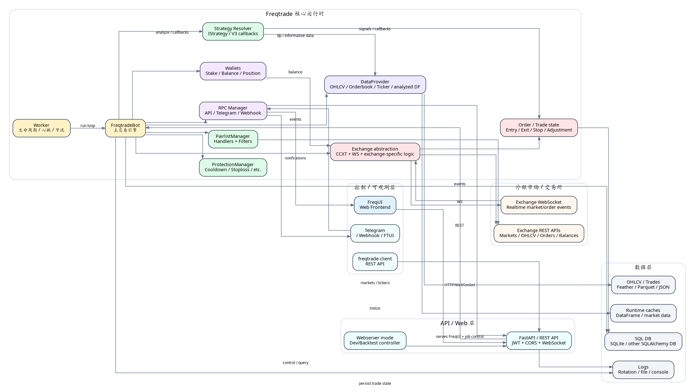
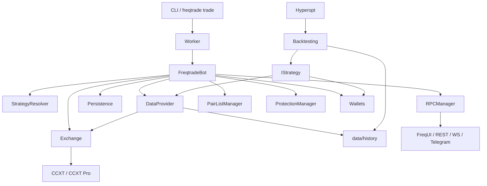
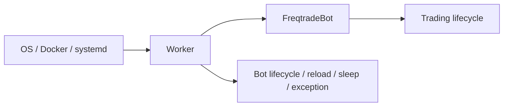
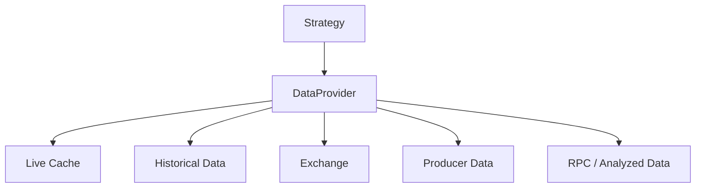
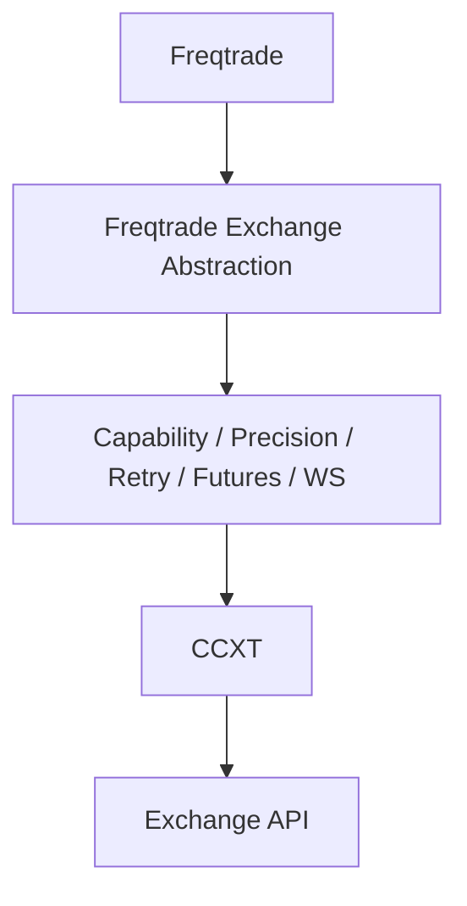
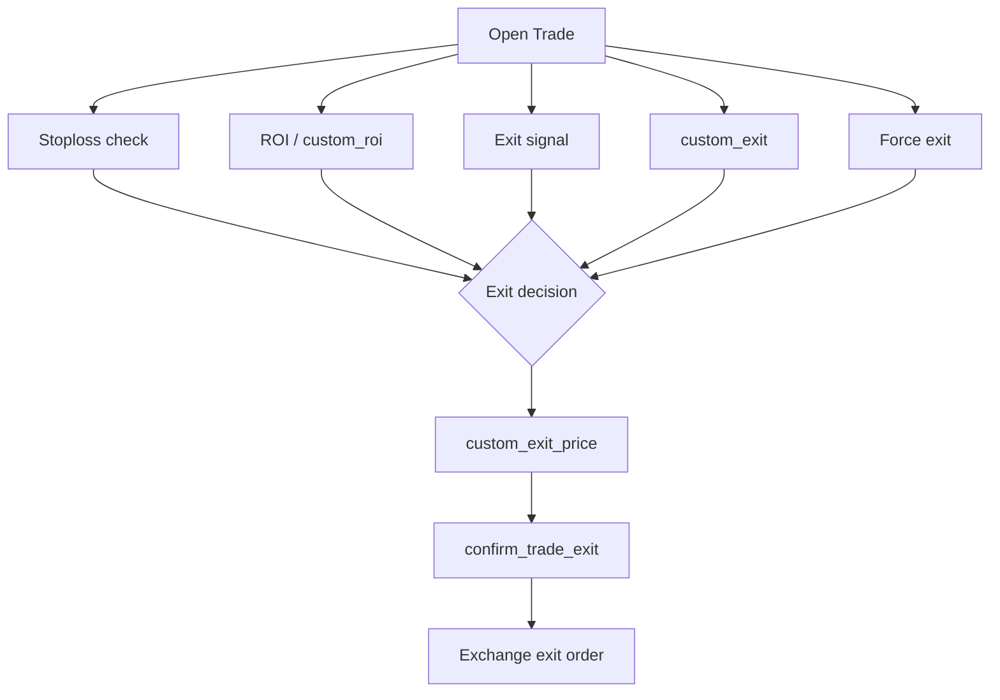
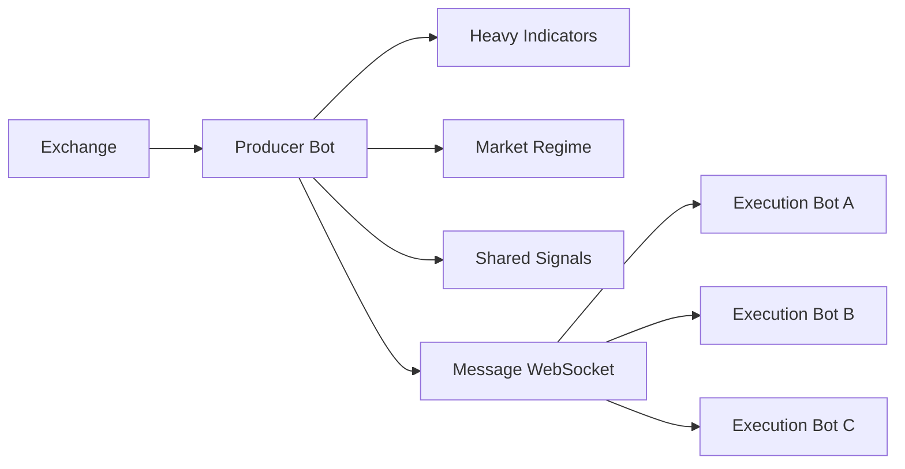
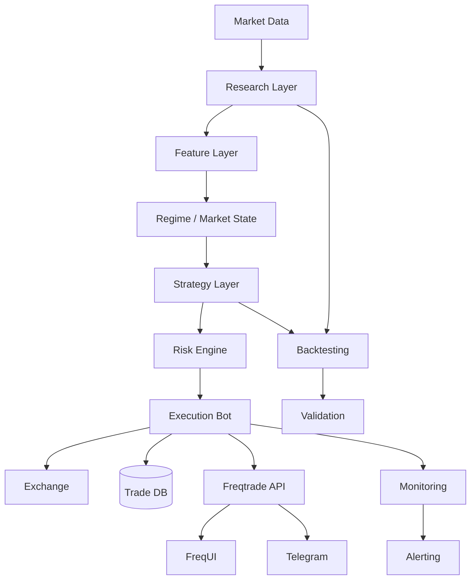
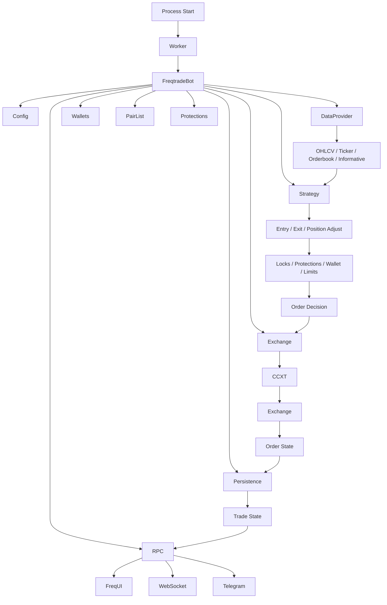

# Freqtrade 全栈深入教程：架构、原理、数据流、多周期、多策略、FreqUI 与云端实盘部署

> **基准版本：Freqtrade 2026.x**。本教程按 2026-08-20 可验证的官方资料整理；当前官方发布线可见 `2026.7`。实际部署时，应始终以你的 Docker image tag、`freqtrade -V` 和对应版本官方文档为最终依据。
>
> 定位：不是“会写几个 `populate_*` 函数”的入门笔记，而是一份面向系统设计、量化研发、实盘运维、代码审阅与多 bot 编排的技术手册。

**从运行时、数据流、策略引擎到多周期、多策略、FreqUI、云服务器与实盘运维**


| **安全边界：**Freqtrade 官方明确建议先 Dry-run，理解资金管理、交易执行和盈亏机制后再接入真实资金。本手册不会把历史回测收益当作未来收益承诺。 |
|----------------------------------------------------------------------------------------------------------------------------------------------|

# 目录与阅读路线

- 第一篇：Freqtrade 是什么、为什么它适合做研究与实盘执行

- 第二篇：完整架构图与组件职责

- 第三篇：一次 K 线从交易所到下单完成的完整数据流

- 第四篇：运行模式、主循环、时间与新 K 线机制

- 第五篇：策略接口体系与 V3 Strategy API

- 第六篇：DataFrame、DataProvider 与数据工程

- 第七篇：多时间周期策略的正确设计方式

- 第八篇：Pairlist、Protection、Wallet、Order/Trade 状态机

- 第九篇：回测、Hyperopt、lookahead、recursive analysis 与验证

- 第十篇：FreqUI、REST API、Telegram、Webhook、freqtrade-client

- 第十一篇：Docker、本地服务器、云 VPS 与反向代理部署

- 第十二篇：一个 FreqUI 管理多个 bot / 多策略实例

- 第十三篇：Producer/Consumer 与“计算层/执行层”拆分

- 第十四篇：监控、日志、数据库、升级、备份、故障恢复

- 第十五篇：实盘架构建议、性能优化与策略工程规范

- 第十六篇：从 0 到生产环境的完整 checklist

- 附录：常用命令、接口速查、策略模板、配置模板与排障手册

# 一、版本与官方资料基线

截至本手册编写时，Freqtrade 官方文档已进入 2026.x 时代；GitHub release 页面可见 2026.7，当前文档已提供 lookahead-analysis / recursive-analysis，并支持通过 webserver / FreqUI 触发相关分析任务；具体 UI 能力应以当前版本为准。教程中的接口命名以当前文档的 Strategy V3、FreqUI、REST API、callbacks、DataProvider 等体系为准。

官方文档首页 https://docs.freqtrade.io/en/latest/

GitHub 仓库 / Releases https://github.com/freqtrade/freqtrade/releases

Strategy callbacks https://docs.freqtrade.io/en/latest/strategy-callbacks/

FreqUI https://docs.freqtrade.io/en/latest/freq-ui/

REST API https://docs.freqtrade.io/en/latest/rest-api/

Data downloading https://docs.freqtrade.io/en/latest/data-download/

## 官方资料与版本核验入口

以下链接用于版本、接口和部署细节的最终核验：

- [官方文档](https://docs.freqtrade.io/en/latest/)
- [Start the bot / 命令与配置](https://docs.freqtrade.io/en/latest/bot-usage/)
- [Strategy callbacks](https://docs.freqtrade.io/en/latest/strategy-callbacks/)
- [Advanced Strategy](https://docs.freqtrade.io/en/latest/strategy-advanced/)
- [FreqUI](https://docs.freqtrade.io/en/latest/freq-ui/)
- [REST API](https://docs.freqtrade.io/en/latest/rest-api/)
- [Data downloading](https://docs.freqtrade.io/en/latest/data-download/)
- [GitHub Releases](https://github.com/freqtrade/freqtrade/releases)

> 官方文档目前明确建议先运行 Dry-run，并强调 REST API 默认绑定 localhost、不要直接暴露到互联网。多 bot 场景下，官方也明确要求使用独立数据库、不同 API 端口等隔离措施。

# 二、Freqtrade 到底是什么

Freqtrade 是用 Python 编写的开源加密资产量化交易框架，核心目标不是替你发明策略，而是把“市场数据 -> 特征/指标 -> 信号 -> 风险管理 -> 订单执行 -> 状态持久化 -> 监控控制 -> 回测/优化”串成一个可运行系统。官方文档把它定位为带回测、绘图、资金管理、策略优化以及 Web UI / Telegram 控制能力的交易机器人。

最重要的认知：Freqtrade 不是单纯的指标库，也不是一个“CSV -> 回测”的脚本集合。它是一个有状态的 trading engine。Strategy 只是核心扩展点之一；真正负责实盘节奏、订单生命周期、钱包、交易记录、RPC、交易所交互的是 Bot / Worker / Exchange / Trade / DB 等外围组件。

# 三、完整架构图



图 1：Freqtrade 从 UI / API、运行时、策略与数据，到交易所执行层的总体结构。

阅读这张图时，建议把系统分成五层：控制层、API/Web 层、核心运行时、数据/持久化层、外部市场层。策略作者主要写 Strategy，但实盘中的“结果”是多个模块协作的产物。

# 四、架构组件逐个拆解

| **组件**                      | **核心职责**                                                                                                          |
|-------------------------------|-----------------------------------------------------------------------------------------------------------------------|
| Worker                        | 进程级生命周期管理、heartbeat、节流、异常处理与 bot 状态。可以把它理解成“操作系统级控制循环”。                        |
| FreqtradeBot                  | 主交易引擎。负责每次 loop 里的 pairlist、数据分析、开放仓位维护、新入场检查、订单处理等。                             |
| Strategy Resolver / IStrategy | 把配置指定的 Strategy class 加载进来，并将策略属性与 callbacks 接入 Bot。                                             |
| DataProvider                  | 为策略提供交易对数据、不同 timeframe 的 DataFrame、ticker、orderbook、analyzed dataframe 等。                         |
| Exchange abstraction          | 通过 CCXT 及交易所扩展把市场数据、余额、订单提交/撤单等统一到 Freqtrade 的接口。不同交易所仍可能存在 feature 差异。   |
| PairlistManager               | 产生当前交易 universe；多个 Pairlist Handler / Filter 会链式执行，最终形成 whitelist。                                |
| ProtectionManager             | 负责交易冷却、连续亏损保护、回撤保护等交易层的“是否允许新仓”。                                                        |
| Wallets                       | 资金、可用 stake、账户余额等抽象，决定实际可下注资金范围。                                                            |
| Trade / Order / DB            | 把订单与交易从“内存对象”变成可恢复的状态；实盘系统本质上必须持久化。                                                  |
| RPC Manager                   | 把内部事件与控制面暴露给 REST API、Telegram、Webhook 等。                                                             |
| FreqUI                        | 前端；它不是交易引擎本身，而是通过 REST API / WebSocket 与 bot 通讯的管理与可视化客户端。                             |
| Webserver mode                | 面向研究效率的特殊运行模式，允许 FreqUI 通过 bot 的 webserver 发起并查看后台研究任务（尤其是 backtesting / analysis）；当前官方文档仍将 webserver mode 标记为 experimental。 |

# 五、一次完整交易循环到底发生了什么

下面用一个“5m 主周期 + 1h 趋势过滤 + Binance Spot”的例子，把一根新 K 线出现后的全过程拆开。

| **步骤**                  | **发生什么**                                                                                                                   |
|---------------------------|--------------------------------------------------------------------------------------------------------------------------------|
| 1\. 市场事件出现          | 交易所 REST/WS 提供最新市场数据。Freqtrade 的 exchange 层负责获取/同步数据。                                                   |
| 2\. Worker 进入下一轮     | Worker 按 throttle 机制驱动 Bot；官方当前文档中的典型默认节奏约为 5 秒级，具体以 internals/process_throttle_secs 等设置为准。  |
| 3\. Pairlist 刷新         | Bot 检查 whitelist 是否需要刷新，PairlistManager 执行 handlers 和 filters。                                                    |
| 4\. 数据准备              | DataProvider 提供 5m 主 dataframe，以及 informative pair/timeframe，例如 BTC/USDT 1h。                                         |
| 5\. 指标计算              | Strategy.populate_indicators() 以向量化方式计算列；多周期数据通过 informative decorator 或 merge_informative_pair 等机制拼接。 |
| 6\. 入场信号              | populate_entry_trend() 生成 enter_long / enter_short、entry_tag 等信号列。                                                     |
| 7\. 风控闸门              | max_open_trades、stake 资金、Pair locks、Protections 等决定“有信号是否真的允许进场”。                                          |
| 8\. 订单报价              | entry_pricing 与 custom_entry_price（如使用）决定拟下单价格。                                                                  |
| 9\. 最终确认              | confirm_trade_entry() 属于靠近执行端的最后一道可编程闸门，适合轻量级确认而不适合重计算或网络请求。                             |
| 10\. Exchange 下单        | Exchange abstraction 调用 CCXT / exchange API 发单。                                                                           |
| 11\. Trade/Order 状态更新 | 订单状态轮询或 WS 事件更新 Trade / Order；数据库持久化。                                                                       |
| 12\. 后续维护             | 持仓期间，custom_stoploss / custom_exit / custom_roi / adjust_trade_position 等 callbacks 周期性参与管理。                     |
| 13\. RPC/UI 更新          | 状态、成交、盈利、错误等通过 RPC 到 REST/WebSocket/Telegram/UI。                                                               |

# 六、运行机制：live / dry_run / backtest / hyperopt 的本质区别

| **模式**  | **真实行情**   | **真实下单**   | **数据来源**          | **执行节奏**      | **主要用途**                  |
|-----------|----------------|----------------|-----------------------|-------------------|-------------------------------|
| live      | 是             | 是             | 交易所 / 本地数据     | 持续 bot loop     | 实盘                          |
| dry_run   | 是             | 否             | 交易所行情 + 模拟执行 | 持续 bot loop     | 实盘前验证                    |
| backtest  | 否             | 否             | 历史 OHLCV / trades   | 按历史时间推进    | 策略验证                      |
| hyperopt  | 否             | 否             | 历史数据              | 批量回测 / 多进程 | 参数搜索                      |
| webserver | 可用于研究任务 | 否（研究任务） | 本地数据/配置         | 按任务执行        | FreqUI 发起 backtest / analysis 等 |

关键区别是：backtesting 追求确定性和速度，会批量处理历史数据；live/dry-run 是有状态实时系统，需要处理订单未成交、交易所延迟、余额变化、网络异常等现实问题。因此，“回测代码能跑”远远不等于“实盘行为正确”。

# 七、主循环与“新 K 线”机制

策略最容易被误解的一点，是 populate_* 与 callbacks 的调用时机不同。官方当前文档明确区分：populate_indicators()、populate_entry_trend()、populate_exit_trend() 应采用向量化写法，而 callbacks 在需要时被调用；回调中应避免重计算。

\# 典型配置思路  
"internals": {  
"process_throttle_secs": 5  
},  
  
\# strategy  
process_only_new_candles = True

process_only_new_candles=True 的工程意义是：当主 timeframe 没有生成新 K 线时，不必每 5 秒重新计算整套 dataframe 指标。这样可以把重计算集中到新 candle，轻逻辑放到 callback 层。若你的策略依赖每秒级价格、订单簿、动态止损等，则必须理解 callbacks 与实时循环的关系，而不能把所有逻辑都塞进 populate_entry_trend。

# 八、Strategy V3：最重要的接口地图

| **接口**                               | **阶段**     | **用途**                            | **实盘频率/特点**                                  |
|----------------------------------------|--------------|-------------------------------------|----------------------------------------------------|
| populate_indicators                    | 分析前处理   | 批量生成指标/特征列                 | 以 dataframe 向量化处理                            |
| populate_entry_trend                   | 入场信号     | 写 enter_long/enter_short/entry_tag | 以 dataframe 向量化处理                            |
| populate_exit_trend                    | 出场信号     | 写 exit_long/exit_short/exit_tag    | 以 dataframe 向量化处理                            |
| custom_exit                            | 持仓管理     | 基于交易对象/利润等即时退出         | 开放仓位每轮检查                                   |
| custom_stoploss                        | 风险控制     | 动态止损                            | 开放仓位每轮检查；也用于 stoploss on exchange 场景 |
| custom_roi                             | 动态 ROI     | 按时间/状态给出最小收益门槛         | 开放仓位每轮检查                                   |
| custom_stake_amount                    | 资金分配     | 动态 stake                          | 入场时                                             |
| confirm_trade_entry                    | 最终入场确认 | 最后一道入场拦截                    | 非常靠近下单，不适合重计算                         |
| confirm_trade_exit                     | 最终退出确认 | 最后一道退出拦截                    | 非常靠近下单                                       |
| adjust_trade_position                  | 仓位调整     | 加仓/减仓/部分退出                  | 可能高频调用，需要避免 loose logic                 |
| custom_entry_price/custom_exit_price   | 自定义价格   | 调整实际报价                        | 需处理成交/超距约束                                |
| adjust_entry_price                    | 限价订单重新定价/替换                         | 未成交订单维护路径                               |
| check_entry_timeout/check_exit_timeout | 挂单超时     | 按自定义条件撤单                    | 每个未成交订单检查                                 |
| order_filled                           | 成交事件     | 订单成交后记录自定义状态等          | 成交后回调                                         |
| leverage                               | 杠杆         | 期货账户杠杆建议值                  | 开仓路径                                           |

# 九、populate_* 的正确使用边界

向量化策略的核心是：不要逐行写 Python for-loop 去判断“这一根 K 线是不是金叉”，而是让 pandas / NumPy / TA-Lib 一次生成整列。这样回测、实盘和 hyperopt 都更容易保持一致。

```python
def populate_indicators(self, dataframe: DataFrame, metadata: dict) -> DataFrame:
    dataframe["ema_fast"] = ta.EMA(dataframe, timeperiod=20)
    dataframe["ema_slow"] = ta.EMA(dataframe, timeperiod=60)
    dataframe["atr"] = ta.ATR(dataframe, timeperiod=14)
    return dataframe

def populate_entry_trend(self, dataframe: DataFrame, metadata: dict) -> DataFrame:
    cond = (
        (dataframe["ema_fast"] > dataframe["ema_slow"])
        & (dataframe["close"] > dataframe["ema_fast"])
        & (dataframe["volume"] > 0)
    )
    dataframe.loc[cond, "enter_long"] = 1
    dataframe.loc[cond, "enter_tag"] = "trend_pullback"
    return dataframe
```

| **实盘原则：**不要把网络请求、复杂数据库查询、机器学习推理等重任务放在 populate_* 每根 candle × 每个 pair 的路径里。高成本任务应提前缓存、放在 bot_start / bot_loop_start，或拆到 Producer/Consumer 计算层。 |
|----------------------------------------------------------------------------------------------------------------------------------------------------------------------------------------------------------------|

# 十、DataFrame：你真正写策略时的核心对象

Freqtrade 策略代码的“语言”实际上是 pandas DataFrame。通常一行是一根 candle，一列是原始 OHLCV 或你计算出来的特征。

| **列**                 | **含义**                              |
|------------------------|---------------------------------------|
| date                   | 时间戳，通常为 UTC-aware datetime     |
| open/high/low/close    | OHLC                                  |
| volume                 | 成交量                                |
| enter_long/enter_short | 入场信号                              |
| exit_long/exit_short   | 退出信号                              |
| enter_tag/exit_tag     | 信号标签                              |
| 自定义列               | EMA、ATR、市场结构、波动率、regime 等 |

最容易犯的错是“向未来看”。例如 shift(-1)、rolling 后不当 center、使用未关闭 candle 进行历史决策、informative dataframe merge 时错误对齐时间，都会造成 lookahead bias。当前 Freqtrade 2026.x 生态已经强化了 lookahead-analysis 与 recursive-analysis 的研究入口，应把它们当作策略开发的基本工具，而不是可有可无的高级功能。

# 十一、DataProvider：策略如何拿到“当前世界”

DataProvider（通常通过 self.dp）是策略访问 Freqtrade 数据生态的主要入口。你会频繁接触这些概念：主 dataframe、informative pair/timeframe、analyzed dataframe、ticker、orderbook、market、pairlist。

```python
# 在 callback 中读取已经分析过的数据
if self.dp:
    dataframe, last_updated = self.dp.get_analyzed_dataframe(pair, self.timeframe)
    last = dataframe.iloc[-1].squeeze()
```

工程上最好区分三种数据：1）历史/已分析数据，用于信号；2）实时市场微观数据，如 ticker/orderbook；3）账户/交易状态，如 wallet、trade、order。不要因为 self.dp 能拿到某数据，就在每个 callback 里不断请求外部 API。

# 十二、多时间周期：Freqtrade 正确做法

多周期不是“在一个策略类里随便调用 resample 就完事”。生产级多周期策略的关键是：每一个 timeframe 都必须有清晰的数据时间语义，并在拼接时避免未来信息泄漏。

最常用的设计：主周期负责执行颗粒度，例如 5m；更高周期负责趋势/环境，例如 1h；更低周期可作为微观确认，但要小心计算成本和未闭合 candle。官方推荐通过 informative pairs / @informative / merge_informative_pair 等方式接入额外 pair/timeframe。

```python
from freqtrade.strategy import informative

class MultiTFStrategy(IStrategy):
    INTERFACE_VERSION = 3
    timeframe = "5m"

    @informative("1h")
    def populate_indicators_1h(self, dataframe: DataFrame, metadata: dict) -> DataFrame:
        dataframe["ema200"] = ta.EMA(dataframe, timeperiod=200)
        return dataframe

    def populate_indicators(self, dataframe: DataFrame, metadata: dict) -> DataFrame:
        dataframe["ema20"] = ta.EMA(dataframe, timeperiod=20)
        dataframe["atr"] = ta.ATR(dataframe, timeperiod=14)
        return dataframe
```

用“1h 决定 regime、5m 决定触发”的方式，很适合趋势 + 回撤、震荡 + 突破等复合策略。核心思想不是堆 10 个指标，而是让不同 timeframe 分担不同信息职责。

# 十三、多周期的数据对齐原则

1.  高周期特征只能在其 candle 已经确定后影响低周期历史决策，不能把高周期尚未结束的值写回过去。

2.  主策略 timeframe 决定交易决策的最小时间粒度；informative timeframe 不应变成隐含的第二套执行时钟。

3.  尽量使用 Freqtrade 提供的 informative decorator / merge_informative_pair，而不是手动 merge_asof 后再自行修正所有时间边界。

4.  回测后跑 lookahead-analysis；如果改一点 column 逻辑，信号数量大幅变化，优先查时间对齐。

5.  对每个 timeframe 设置足够的 startup_candle_count，保证高周期指标有完整 warm-up。

# 十四、startup_candle_count、warm-up 与指标热身

如果你的 1h EMA200 是趋势过滤器，那么策略至少需要足够的 1h 数据来计算 EMA200；换算到 5m 主周期就是约 2400 根 5m candle 的数据需求量级。startup_candle_count 的目的，就是让回测/实盘在真正开始产生信号前，先准备足够的历史数据。

```python
timeframe = "5m"
startup_candle_count = 2500
```

| **经验法则：**startup_candle_count 不应该拍脑袋写一个 100。它应该由最长指标窗口 × 多周期换算 × 额外安全余量决定。 |
|-------------------------------------------------------------------------------------------------------------------|

# 十五、Informative Pairs 与 @informative

官方文档指出，informative pairs 用于获取策略并不直接交易的数据，例如 BTC/USDT 1h、ETH/USDT 15m。它们会作为常规数据刷新的一部分被加载，最终通过 DataProvider 供策略使用。

```python
def informative_pairs(self):
    return [
        ("BTC/USDT", "1h"),
        ("BTC/USDT", "4h"),
    ]
```

实际项目中更推荐先判断“这是市场上下文数据，还是交易标的自己的多周期数据”。前者适合做全局 risk-on/risk-off 过滤，后者更适合趋势确认。

# 十六、Pairlist：策略不是对“所有币”运行

PairlistManager 决定当前交易 universe。官方支持 Static、Volume、PercentChange、Producer、Remote、MarketCap、CrossMarket 等 Handler，以及 AgeFilter、DelistFilter、PrecisionFilter、SpreadFilter、VolatilityFilter 等 Filter。多个 handler/filter 按配置顺序链式执行。

| **层次**     | **示例**         | **目的**         |
|--------------|------------------|------------------|
| 起始 Handler | StaticPairList   | 明确指定一组标的 |
| 动态 Handler | VolumePairList   | 按成交量动态选币 |
| 过滤器       | AgeFilter        | 过滤上市时间过短 |
| 过滤器       | SpreadFilter     | 过滤点差异常     |
| 过滤器       | VolatilityFilter | 控制波动范围     |
| 黑名单       | pair_blacklist   | 硬性排除         |

研究时要把 Pairlist 当成策略的一部分，因为 universe 选择本身会改变策略表现；而不是只把它看成“配置细节”。

# 十七、Protection：交易级“刹车系统”

保护机制不是 entry signal，它位于策略信号与资金执行之间。典型思路包括 CooldownPeriod、StoplossGuard、MaxDrawdown 等。实盘时，它们的价值往往高于继续增加一个指标。

```python
@property
def protections(self):
    return [
        {
            "method": "CooldownPeriod",
            "stop_duration_candles": 4,
        },
        {
            "method": "StoplossGuard",
            "lookback_period_candles": 24,
            "trade_limit": 3,
            "stop_duration_candles": 12,
            "only_per_pair": False,
        },
    ]
```

| **版本注意：**当前 2026.x 文档的 protection 配置方式需要以对应版本文档为准；旧教程中经常会出现把 protections 全写在 config.json 的示例。升级策略时要优先检查当前 schema 与 strategy property 的行为。 |
|-------------------------------------------------------------------------------------------------------------------------------------------------------------------------------------------------------|

# 十八、Wallet、stake amount 与资金管理

“信号对了就下单”是新手视角；真实交易引擎还要判断：可用余额、最大开放交易数、单笔 stake、最小下单量、交易所 precision、手续费、杠杆与保证金模式。

| **概念**               | **作用**                                                |
|------------------------|---------------------------------------------------------|
| max_open_trades        | 全局最多同时持有多少交易                                |
| stake_amount           | 单笔默认资金基准                                        |
| tradable_balance_ratio | 只允许使用账户资产的一部分                              |
| custom_stake_amount    | 策略级动态资金分配                                      |
| min_stake/max_stake    | 交易所与配置约束下的有效范围                            |
| leverage               | 期货策略的杠杆层，注意收益/止损的百分比语义包含杠杆影响 |

官方当前回调文档特别强调：custom_stake_amount 返回的数值最终会被系统 clamp 到允许范围；返回 0 或 None 可阻止下单。

# 十九、Trade 与 Order：为什么必须理解状态机

在实盘中，“下单”不是一个瞬时动作。一个 entry 可能经历：signal -> proposed order -> placed -> open -> partial fill -> full fill -> canceled / expired。Trade 是持仓/交易层状态，Order 是具体订单层状态。

| **状态**   | **典型问题**                                 |
|------------|----------------------------------------------|
| 信号产生   | 策略想进场，但资金/保护条件不允许            |
| 订单已提交 | 交易所网络延迟或 API 超时                    |
| 订单未成交 | 价格偏离、流动性不足、timeout                |
| 部分成交   | 需要更新持仓与剩余数量                       |
| 已成交     | 进入持仓管理 callbacks                       |
| 退出信号   | 可能是 ROI / signal / stoploss / custom_exit |
| 结束       | 最终 P&L、手续费、exit reason 写入 DB        |

因此生产级策略绝对不能只验证“enter_long 是否为 1”。要验证 order fill、timeout、cancel、stoploss、partial fill 和 restart recovery。

# 二十、常用策略 callbacks 详解

## bot_start()

bot 启动时执行一次。适合初始化缓存、读取远程静态信息、创建一次性资源。不要用它做需要每个 candle 都刷新的任务。

def bot_start(self, \*\*kwargs):  
self.remote_cache = {...}

## bot_loop_start()

每轮 bot loop 开始时调用；官方文档指出 live/dry_run 约每 5 秒级，而 backtest/hyperopt 则按 candle 推进。适合 pair-independent 的外部数据同步。

def bot_loop_start(self, current_time, \*\*kwargs):  
self.market_regime = self.\_load_regime()

## custom_stake_amount()

把固定 stake 变成 risk-based stake，例如按 ATR、波动率、组合暴露、当前回撤缩放。

def custom_stake_amount(self, pair, current_time, current_rate, proposed_stake, min_stake, max_stake, leverage, entry_tag, side, \*\*kwargs):  
return min(proposed_stake, max_stake)

## custom_exit()

最适合 trade-aware 的退出。比如盈利超过某阈值且结构转坏，或亏损持仓超过最大时间。

def custom_exit(self, pair, trade, current_time, current_rate, current_profit, \*\*kwargs):  
if current_profit > 0.08:  
return "take_profit_regime_shift"  
return None

## custom_stoploss()

动态止损，例如 ATR trailing、结构位止损。它不是“另一个 exit signal”，语义上应专注风险线。

def custom_stoploss(self, pair, trade, current_time, current_rate, current_profit, after_fill, \*\*kwargs):  
return 0.03

## adjust_trade_position()

适合 DCA / partial exit / scale-in/out，但因为可能高频调用，非常容易写出重复加仓。官方文档专门提醒 loose logic 的重复调用风险。

def adjust_trade_position(self, trade, current_time, current_rate, current_profit, min_stake, max_stake, current_entry_rate, current_exit_rate, current_entry_profit, current_exit_profit, \*\*kwargs):  
return None

## confirm_trade_entry()/confirm_trade_exit()

最后一级拦截点。可检查瞬时滑点、spread、异常行情，但应避免网络请求。

def confirm_trade_entry(self, pair, order_type, amount, rate, time_in_force, current_time, entry_tag, side, \*\*kwargs):  
return True

## check\_\*\_timeout()

对未成交订单做动态超时判断，必要时结合 spread、volatility、orderbook 等。

def check_entry_timeout(self, pair, trade, order, current_time, \*\*kwargs):  
return False

## order_filled()

订单成交之后的事件入口，可把 entry 时的高点、成交批次、交易标签等写入 trade custom data。

def order_filled(self, pair, trade, order, current_time, \*\*kwargs):  
trade.set_custom_data(key="entry_note", value="filled")

# 二十一、自定义持久化 trade data

官方高级策略文档允许通过 Trade.set_custom_data()/get_custom_data() 保存与某笔 trade 关联的自定义数据。例如：第一次入场的 ATR、市场 regime、分批加仓次数、结构状态。

```python
trade.set_custom_data(key="initial_atr", value=float(last_atr))
atr = trade.get_custom_data(key="initial_atr")
```

| **数据治理：**不要把大 DataFrame、模型对象、二进制 blob 塞进 Trade custom data；它应该是“小而稳定”的状态值。 |
|--------------------------------------------------------------------------------------------------------------|

# 二十二、回测：你真正应该验证什么

回测不是为了找到“净利润最大”的参数，而是为了回答五个问题：策略是否有 edge、收益来自什么市场状态、风险是否可接受、交易成本是否被正确计入、结果是否具有时间外稳定性。

| **检查项**                 | **为什么重要**         |
|----------------------------|------------------------|
| Profit / CAGR              | 收益水平               |
| Max Drawdown               | 生存能力               |
| Profit Factor / Expectancy | 单笔交易质量           |
| Trade count                | 样本量                 |
| Avg duration               | 资金占用               |
| Worst trade                | 尾部风险               |
| Daily/weekly distribution  | 收益是否集中在少数日期 |
| Exit reason distribution   | 策略真正靠什么赚钱     |
| Long/Short breakdown       | 方向是否偏科           |
| Pair breakdown             | 收益是否依赖少数标的   |

Freqtrade 官方持续加入 backtest metrics 与 UI 分析能力；2026.x 还强化了 P-Value、lookahead/recursive analysis 等研究入口。因此现在更应该把“数据诊断”和“偏差检测”纳入正式流程。

# 二十三、Hyperopt：不要把它当魔法寻参器

Freqtrade 当前 Hyperopt 使用 Optuna 相关算法进行搜索；文档说明它会先加载数据，然后多进程重复运行回测，依据 loss function 选择下一组参数。

freqtrade hyperopt \\  
--strategy MyStrategy \\  
--hyperopt-loss SharpeHyperOptLossDaily \\  
--spaces enter exit stoploss roi \\  
-e 500

工程上更重要的是 search space 设计：一个参数范围过大的 strategy 很容易把市场噪音“优化成信号”。建议先固定 risk model，再小范围优化 entry/exit；然后做 out-of-sample 与 walk-forward。

# 二十四、Lookahead Analysis 与 Recursive Analysis

Lookahead analysis 的目标是发现策略是否无意中使用未来信息；recursive analysis 更适合检查指标递归计算、startup window、逐步计算与完整 dataframe 预计算之间的差异。2026.x 还把这些能力进一步带到了 FreqUI。

6.  先用原始策略跑 backtest。

7.  跑 lookahead-analysis；任何异常先查 shift、merge、rolling、informative 时间对齐。

8.  跑 recursive-analysis，验证 startup_candle_count 是否造成指标初期偏差。

9.  再做真正 out-of-sample；避免用同一时间段反复调参。

# 二十五、数据下载与本地数据层

官方 download-data 支持通过 \`--timeframes\` 指定多个周期；当前文档支持 feather、json、jsongz、parquet 等 OHLCV/trades 数据格式，默认推荐 feather 或 parquet 作为性能/大小的折中。

freqtrade download-data \\  
--exchange binance \\  
--pairs BTC/USDT ETH/USDT SOL/USDT \\  
--timeframes 1m 5m 15m 1h 4h \\  
--timerange 20240101-

多周期策略应该把“数据下载计划”当成项目文件的一部分：不要等策略写完才发现 1h 或 4h 历史不够。

# 二十六、FreqUI：它到底是什么

FreqUI 是 Freqtrade 自带的前端，依托 bot 的内置 webserver 和 REST API。官方强调它不是运行 Freqtrade 的必要条件；你完全可以只使用命令行、Telegram 或 REST API。

| **页面/功能**          | **用途**                                               |
|------------------------|--------------------------------------------------------|
| Dashboard              | 总体状态、绩效、钱包余额走势、多个 bot 切换            |
| Trade                  | 当前交易、手动 start/stop、配置允许时 force entry/exit |
| Charts                 | K 线、指标、交易点位、策略 annotation                  |
| Backtesting            | webserver 模式下发起/查看/比较回测                     |
| Configuration/Settings | 查看/管理部分配置与 UI 设置                            |
| Bot selector           | 连接多个 bot，在多个实例间切换或聚合                   |

特别值得注意：2026.4 起 FreqUI 增加了 Wallet Balance 历史图，可以更直观地看到包含未实现盈亏的真实余额轨迹；当前 Dashboard 也支持多个 bot 的聚合视图。

# 二十七、一个 FreqUI 管理多个策略 / bot 的正确理解

FreqUI 多 bot，不等于“一个 Python 进程同时跑多个 Strategy”。更加稳健的生产思路是：每个策略实例通常是独立 bot/container，拥有自己的 config、DB、logs、API port、strategy；FreqUI 作为统一控制面连接这些 API。

```text
Bot A: 8081 -> StrategyTrend -> Binance spot -> trades_a.sqlite
Bot B: 8082 -> StrategyBreakout -> Binance spot -> trades_b.sqlite
Bot C: 8083 -> StrategyMeanReversion -> OKX spot -> trades_c.sqlite

FreqUI: 统一前端 -> 连接 8081 / 8082 / 8083
```

这样做的好处是故障隔离：一个 bot 因 Strategy exception、第三方依赖、内存问题退出，不会把整个策略组合拖死。缺点是进程更多、数据计算可能重复。这个矛盾恰好可以用 Producer/Consumer 进一步解决。

# 二十八、REST API：FreqUI 背后的控制平面

REST API 是 FreqUI 与 bot 沟通的核心接口。当前文档推荐使用 freqtrade-client 或 OpenAPI/REST endpoints 消费 API。API 默认监听 localhost；官方强烈建议不要把 API 直接暴露到互联网，并要求使用强密码与随机 JWT secret。

```json
"api_server": {
  "enabled": true,
  "listen_ip_address": "127.0.0.1",
  "listen_port": 8080,
  "username": "freqtrader",
  "password": "REPLACE_WITH_STRONG_PASSWORD",
  "jwt_secret_key": "REPLACE_WITH_RANDOM_32PLUS_CHAR_SECRET",
  "CORS_origins": []
}
```

如果用 Nginx / Caddy / Traefik 做 TLS 反代，建议外网只暴露 443，bot 的 808x 仅绑定 localhost 或 Docker internal network。不要为了“远程访问方便”直接把 8080 映射到 0.0.0.0。官方 REST API 文档明确警告，这会让有正确认证凭据的人能够控制 bot。

# 二十九、Telegram / Webhook / FTUI / client 的位置

| **工具**         | **定位**          | **适合场景**                   |
|------------------|-------------------|--------------------------------|
| FreqUI           | 图形化控制台      | 日常运维、图表、回测、bot 总览 |
| Telegram         | 消息/轻控制       | 手机告警、快速停止、成交通知   |
| Webhooks         | 事件出口          | 接 Discord/自建告警系统        |
| FTUI             | 终端监控          | SSH 下快速看状态               |
| freqtrade-client | Python API client | 自动化运维、脚本、内控平台     |
| REST API         | 底层接口          | 自建控制台、量化平台集成       |

# 三十、云服务器部署：推荐 Docker 路线

官方对新用户推荐 Docker；官方硬件建议是 Linux cloud instance，最低量级约 2GB RAM、1GB 磁盘、2 vCPU。实际做多策略与 backtest/hyperopt 时，应该按数据量与并发计算提高规格。

\# 示例：Ubuntu + Docker 路线  
sudo apt update  
sudo apt install -y git curl  
  
git clone https://github.com/freqtrade/freqtrade.git  
cd freqtrade  
  
docker compose pull  
docker compose run --rm freqtrade create-userdir --userdir user_data  
docker compose run --rm freqtrade new-config --config user_data/config.json

生产环境建议把策略代码、config、DB 与日志目录放在 persistent volume。不要把交易数据库只放在容器 writable layer，否则重建容器时容易失联。

# 三十一、Docker 多 bot 编排

```yaml
services:
  bot_trend:
    image: freqtradeorg/freqtrade:stable
    container_name: ft_trend
    restart: unless-stopped
    volumes:
      - ./bots/trend/user_data:/freqtrade/user_data
    ports:
      - "127.0.0.1:8081:8080"
    command: >
      trade
      --config /freqtrade/user_data/config.json
      --strategy TrendStrategy

  bot_breakout:
    image: freqtradeorg/freqtrade:stable
    container_name: ft_breakout
    restart: unless-stopped
    volumes:
      - ./bots/breakout/user_data:/freqtrade/user_data
    ports:
      - "127.0.0.1:8082:8080"
    command: >
      trade
      --config /freqtrade/user_data/config.json
      --strategy BreakoutStrategy
```

每个 bot 独立 config + DB + port。公用配置可以用多个 config 文件拆分，但最终每个 bot 都应该有自己的可审计运行配置。

# 三十二、统一 FreqUI 的两种方案

方案 A：FreqUI 自己连接多个 bot API。这是当前 FreqUI 明确支持的路径；多个 bot API 在 localhost:8081、8082... 时，CORS 配置需要正确设置。方案 B：在云服务器上只对外暴露一个 TLS 域名，由反向代理将不同路径路由到不同 bot API，例如 /bot1 -> 8081、/bot2 -> 8082，或单独部署一个共享 FreqUI 静态前端。

| **方案**                  | **优点**               | **缺点**             | **建议** |
|---------------------------|------------------------|----------------------|----------|
| 多 API + 一个 FreqUI 前端 | 清晰、隔离、容易理解   | 需要 CORS / 连接管理 | 推荐     |
| Nginx 路径反代            | 只暴露 443，安全面更好 | 路由规则更复杂       | 生产推荐 |
| 直接公网开放 8081/8082    | 最简单                 | 攻击面大             | 不推荐   |

# 三十三、Nginx/Caddy 反向代理的生产思想

核心不是“怎么写一段 Nginx 配置”，而是网络边界：Internet -> HTTPS reverse proxy -> localhost/internal Docker network -> Freqtrade API。这样 Freqtrade API 不直接对公网暴露。

Internet  
\|  
HTTPS :443  
v  
Nginx / Caddy / Traefik  
\|  
+--> bot-trend:8080  
+--> bot-breakout:8080  
+--> bot-meanrev:8080

同时要限制 SSH、UFW/security group、fail2ban（如采用）、证书自动续期、系统自动安全更新、Docker daemon 权限。交易系统里最危险的不一定是 bug，有时是“把管理 API 公开到了互联网”。

# 三十四、数据库：SQLite 什么时候够用，什么时候应该升级

当前源码默认使用 SQLite URL：live 默认为 `sqlite:///tradesv3.sqlite`，dry-run 在未显式指定其他数据库时默认为 `sqlite:///tradesv3.dryrun.sqlite`；也可以通过 `--db-url sqlite://` 显式使用内存数据库。对于个人单 bot、低频交易，SQLite 通常足够；当 bot 数量多、并发控制需求增加、需要集中备份/分析时，可以考虑独立 SQL 数据库。

\# 典型 CLI override  
freqtrade trade \\  
-c config.json \\  
--db-url sqlite:///tradesv3.dryrun.sqlite

注意：不要把交易 DB 设计成唯一的数据源。策略参数、config、代码版本、数据版本、回测结果都应该可恢复，否则 DB 有了，系统仍然无法重建。

# 三十五、Producer / Consumer：多策略计算优化的关键

官方 Producer/Consumer 模式允许一个实例作为 producer，把 analyzed_df、whitelist 等通过 message websocket 提供给 consumer。这样多个 consumer 可以复用已经计算好的指标与信号，避免每个 bot 都重复算相同的数据。

Producer  
BTC/USDT 5m  
+ indicators  
+ analyzed dataframe  
\|  
+----> Consumer A: Trend execution  
+----> Consumer B: Breakout execution  
+----> Consumer C: Risk overlay

这是非常重要的架构思想：把“研究/计算”和“执行/资金管理”分开。尤其当你有多个策略共享相同高周期市场状态（例如 BTC 1h regime、市场 breadth、宏观 risk filter）时，Producer/Consumer 可以减少重复计算。

# 三十六、多策略体系：不要把六个策略硬塞到一个 Strategy 类里

如果目标是组合策略，常见有三种设计：

10. 单一 Strategy 内部做 ensemble：最简单，但代码耦合高。

11. 多个 bot，各自独立 Strategy：隔离最好，便于比较与控制，但计算重复。

12. Producer + 多 Consumer：共享数据计算层，各 Consumer 负责独立交易逻辑，适合规模化。

我更推荐研究阶段采用“多个 bot 独立策略”，成熟后对重复的数据计算进行 Producer/Consumer 优化。因为在策略尚未稳定时，工程复杂度本身就是风险。

# 三十七、实盘多周期策略的建议架构

Market Data  
\|  
+-- 1m / 5m raw candles  
+-- 15m / 1h / 4h informative candles  
\|  
v  
DataProvider  
\|  
+-- feature layer  
\| +-- trend regime (1h/4h)  
\| +-- volatility (15m/1h)  
\| +-- trigger (5m)  
\|  
v  
Entry / Exit vectorized signals  
\|  
v  
Risk gate  
+-- protections  
+-- max_open_trades  
+-- wallet / stake  
+-- spread / liquidity  
\|  
v  
Order execution  
+-- custom price  
+-- timeout  
+-- fill tracking  
\|  
v  
Trade state + DB + monitoring

# 三十八、不要堆指标：如何设计更高级的多周期策略

结合量化工程的实践，建议把特征分成“信息层级”，而不是把指标数量当作策略复杂度。

| **层级**  | **典型问题**           | **示例**                               |
|-----------|------------------------|----------------------------------------|
| Regime    | 现在是什么市场状态？   | 趋势/震荡、波动率高低、风险偏好        |
| Context   | 当前价格处于什么结构？ | 高低点、区间边界、成交量结构           |
| Trigger   | 什么时候真正执行？     | 突破、回撤结束、结构重新站回           |
| Risk      | 这次应该下多少？       | ATR、距离止损、组合相关性              |
| Execution | 怎么尽量少损耗？       | spread、orderbook、limit timeout、滑点 |

这样做通常比“EMA + RSI + MACD + Bollinger + ADX + Stoch...”更容易解释、回测、迁移与排障。

# 三十九、性能优化：最常见的瓶颈

| **瓶颈**               | **症状**        | **优化方向**                                        |
|------------------------|-----------------|-----------------------------------------------------|
| 重复 indicator 计算    | 多 bot CPU 高   | 共享计算、Producer/Consumer、减少 informative pairs |
| DataFrame 大量复制     | 内存高          | 避免不必要 copy/merge，减少大列对象                 |
| callback 重计算        | live loop 卡顿  | 把逻辑移到向量化或缓存                              |
| 过多 informative pairs | 启动慢 / 内存高 | 只保留真正需要的上下文                              |
| hyperopt 参数空间太大  | 跑几天还没稳定  | 缩小 space，先优化少数核心参数                      |
| 日志过多               | 磁盘增长        | loglevel、rotation、保留策略                        |
| 回测数据太多           | 研究慢          | 分阶段下载、按 pair/timeframe 规划                  |

# 四十、实盘安全：API、密钥与权限

13. 交易所 API key 只开交易所需权限；通常不需要提现权限。

14. Freqtrade REST API 不要直接公网开放 8080/8081/8082。

15. username/password 使用强随机值，JWT secret 使用随机且足够长字符串；官方当前文档建议 32+ 字符。

16. API/CORS 只允许实际使用的前端 origin。

17. Docker secret / environment / secret manager 管理密钥，避免直接 commit config.json。

18. 所有生产机器建立独立 SSH key、非 root 日常账号和安全组规则。

# 四十一、日志与故障排查：从 log 反推架构

Freqtrade 日志其实是一个非常好的“系统示意图”。当你看到类似“Using resolved strategy -> Using CCXT -> Wallets synced -> Pairlist refresh -> Strategy populate -> Running”时，就能顺着架构反向定位。

| **日志现象**                   | **优先检查**                                     |
|--------------------------------|--------------------------------------------------|
| strategy not found             | strategy path / class name / syntax              |
| Pairlist empty                 | exchange market、filters、blacklist、API         |
| No data left                   | download-data / timeframe / timerange / startup  |
| API auth failure               | username/password/JWT/CORS                       |
| Order timeout                  | pricing / liquidity / unfilledtimeout / exchange |
| Trade opened but no exit       | ROI / exit signal / custom_exit / stoploss       |
| Bot restarted with stale state | DB / volume mount / permissions                  |
| UI blank or CORS               | API port / origins / reverse proxy / websocket   |

# 四十二、升级策略与 Freqtrade 版本时的原则

Freqtrade 更新很活跃。当前 2026.x 连续加入 UI、回测、交易所与 API 变化，因此不要把升级理解成“docker pull 一下就结束”。建议每次升级建立：代码版本、镜像版本、配置 schema、策略回归、dry-run smoke test 五件套。

19. 记录旧镜像 tag / git commit。

20. 备份 config、strategy、DB、data inventory。

21. 先在 staging bot dry-run。

22. 跑最小回归 backtest + lookahead + recursive analysis。

23. 升级后观察日志和 UI，确认 API / DB migration 正常。

# 四十三、推荐的云端目录结构

/opt/freqtrade/  
├── compose.yml  
├── .env  
├── bots/  
│ ├── trend/  
│ │ └── user_data/  
│ │ ├── config.json  
│ │ ├── strategies/  
│ │ ├── data/  
│ │ ├── logs/  
│ │ └── tradesv3.sqlite  
│ ├── breakout/  
│ │ └── user_data/...  
│ └── meanrev/  
│ └── user_data/...  
├── backups/  
├── scripts/  
└── monitoring/

这套结构把“一个 bot 是一个可迁移单元”作为原则。迁移 VPS 时，复制 user_data + compose + secrets 即可重建。

# 四十四、从 0 到实盘的完整工作流

24. 1\. 建立 git 仓库；不要直接在服务器上随手改 strategy。

25. 2\. 安装 Freqtrade；优先 Docker。

26. 3\. 创建 user_data、config、strategy path。

27. 4\. 下载主周期与 informative 周期数据。

28. 5\. 写最小 Strategy，只验证数据流。

29. 6\. 用 freqtrade list-data / download-data 检查数据完整性。

30. 7\. backtest，先不 hyperopt。

31. 8\. 做 lookahead-analysis 与 recursive-analysis。

32. 9\. 再用 Hyperopt 搜核心参数。

33. 10\. 用 out-of-sample / walk-forward 验证。

34. 11\. 进入 dry-run，重点观察订单、timeout、stoploss、restart recovery。

35. 12\. 接入 FreqUI / Telegram / logs。

36. 13\. 开小资金实盘，观察交易所实际成交偏差。

37. 14\. 建立周/月度绩效与风险报告。

38. 15\. 只有在稳定运行后再增加策略数量与多 bot 规模。

# 四十五、最小生产级 Docker compose 示例

services:  
ft_trend:  
image: freqtradeorg/freqtrade:stable  
restart: unless-stopped  
volumes:  
- ./bots/trend/user_data:/freqtrade/user_data  
ports:  
- "127.0.0.1:8081:8080"  
command: >  
trade  
--config /freqtrade/user_data/config.json  
--strategy TrendStrategy  
  
ft_breakout:  
image: freqtradeorg/freqtrade:stable  
restart: unless-stopped  
volumes:  
- ./bots/breakout/user_data:/freqtrade/user_data  
ports:  
- "127.0.0.1:8082:8080"  
command: >  
trade  
--config /freqtrade/user_data/config.json  
--strategy BreakoutStrategy

注意：上面是架构模板，不是可直接投入真实资金的完整交易配置。真实系统仍需补上 exchange、pairlist、staking、telegram、api_server、database、日志和密钥管理。

# 四十六、最小生产级 config 思路

{  
"\$schema": "https://schema.freqtrade.io/schema.json",  
"bot_name": "ft-trend",  
"max_open_trades": 3,  
"stake_currency": "USDT",  
"stake_amount": 100,  
"tradable_balance_ratio": 0.95,  
"fiat_display_currency": "USD",  
"dry_run": true,  
  
"exchange": {  
"name": "binance",  
"key": "ENV_OR_SECRET",  
"secret": "ENV_OR_SECRET",  
"pair_whitelist": ["BTC/USDT", "ETH/USDT"],  
"pair_blacklist": []  
},  
  
"pairlists": [  
{"method": "StaticPairList"}  
],  
  
"api_server": {  
"enabled": true,  
"listen_ip_address": "127.0.0.1",  
"listen_port": 8080,  
"username": "CHANGE_ME",  
"password": "CHANGE_ME",  
"jwt_secret_key": "CHANGE_ME_RANDOM_32PLUS"  
}  
}

生产环境不要照抄示例中的任何明文密码或 key。更不要把真实 secrets 提交到 Git。

# 四十七、实盘多策略管理：推荐的最终拓扑

Internet  
\|  
HTTPS :443  
\|  
+----------v----------+  
\| Reverse Proxy / SSO \|  
+----------+----------+  
\|  
+----------------+----------------+  
\| \| \|  
FreqUI / Admin Telegram/Alert Ops Scripts  
\|  
+------+----------------------------------------+  
\| REST / WS \|  
v v v \|  
+---------+ +---------+ +---------+ \|  
\| Bot A \| \| Bot B \| \| Bot C \| \|  
\| Trend \| \| Breakout\| \| MeanRev \| \|  
\| 8081 \| \| 8082 \| \| 8083 \| \|  
+----+----+ +----+----+ +----+----+ \|  
\| \| \| \|  
+------------------+------------------+ \|  
\| \|  
shared market context \|  
Producer / cache \|  
\| \|  
Exchange APIs \|

如果你的三套策略都需要 BTC 1h regime，最值得优化的是共享这部分计算，而不是让每个 bot 都各算一次。

# 四十八、策略工程规范：建议直接写进项目 README

- 每个策略声明 INTERFACE_VERSION=3，并锁定依赖版本。

- populate_* 只负责向量化特征和信号，不做网络 I/O。

- callbacks 只做必要的 trade-aware 动态逻辑。

- 所有 entry/exit 都写 entry_tag/exit_tag，方便 UI 与统计分析。

- 每个高周期 informative 数据都记录其时间语义。

- 所有新增特征先跑 lookahead-analysis。

- 所有 startup_candle_count 修改后重新做 recursive-analysis。

- 所有涉及仓位调整的逻辑必须防止同一条件在每个 throttle loop 重复触发。

- 所有实盘策略都必须 dry-run smoke test 后才能 live。

- 所有 bot 都有独立 DB、日志与 port，并由统一 FreqUI 管理。

# 四十九、常用命令速查

\# 查看帮助  
freqtrade -h  
freqtrade trade -h  
freqtrade backtesting -h  
freqtrade hyperopt -h  
  
\# 初始化  
freqtrade create-userdir --userdir user_data  
freqtrade new-config --config user_data/config.json  
freqtrade new-strategy --strategy MyStrategy --template advanced  
  
\# 数据  
freqtrade download-data --exchange binance --pairs BTC/USDT --timeframes 5m 1h  
freqtrade list-data --show-timerange  
freqtrade list-data --show-timerange --data-format-ohlcv feather  
  
\# 回测  
freqtrade backtesting --strategy MyStrategy --config user_data/config.json  
freqtrade backtesting --strategy MyStrategy --timerange 20240101-20250101  
  
\# Hyperopt  
freqtrade hyperopt --strategy MyStrategy --spaces enter exit stoploss roi -e 500  
  
\# 实盘 / dry-run  
freqtrade trade --config user_data/config.json --strategy MyStrategy --dry-run  
freqtrade trade --config user_data/config.json --strategy MyStrategy  
  
\# Webserver  
freqtrade webserver --config user_data/config.json  
  
\# UI  
freqtrade install-ui

# 五十、常见误区总表

| **误区**                         | **正确理解**                                                |
|----------------------------------|-------------------------------------------------------------|
| FreqUI 就是 Freqtrade            | 不是；FreqUI 是前端，bot 可以无 UI 运行                     |
| Strategy 就等于整个系统          | 不是；Strategy 是扩展点，Bot/Exchange/Trade/DB 等决定运行时 |
| 多周期 = 一个 dataframe resample | 不完全是；重点是时间对齐、数据语义与避免未来数据            |
| hyperopt 找到的参数就是最优参数  | 不是；只是样本内 loss 下的候选解                            |
| 回测赚钱就可以直接实盘           | 不是；成交、滑点、延迟、订单状态都会改变结果                |
| 多个策略一定要一个进程           | 不是；多实例 + 一个 FreqUI 更易隔离                         |
| 所有东西放 custom_exit           | 不推荐；signal、ROI、stoploss、trade-aware exit 应分工      |
| callback 里想怎么算都可以        | 不对；callbacks 可能高频执行，重计算会拖慢 bot loop         |
| API 放公网加密码就安全           | 不推荐；官方仍建议不要直接公网暴露，优先反向代理 / 内网     |

# 五十一、最终推荐：一套适合持续迭代的量化研发体系

如果你的目标不是“跑一个策略玩玩”，而是长期做量化投资，我建议把 Freqtrade 当成一个交易基础设施，而不是一个策略脚本。上层是策略研究，下层是稳定执行。

Research Layer  
- notebooks / feature research  
- backtesting  
- hyperopt  
- lookahead / recursive analysis  
- walk-forward  
  
Strategy Layer  
- regime  
- context  
- trigger  
- risk  
- execution  
  
Execution Layer  
- FreqtradeBot  
- Exchange / CCXT  
- Order / Trade  
- Wallet  
- Protection  
  
Control Layer  
- FreqUI  
- REST API  
- Telegram / webhook  
- logs / monitoring  
  
Infrastructure Layer  
- Docker  
- VPS  
- reverse proxy  
- backups  
- git / CI

最终形成的不是“一个神奇策略”，而是一套可重复、可审计、可回滚、可扩展的研究与执行系统。

# 附录 A：官方文档索引

Home / Introduction https://docs.freqtrade.io/en/latest/

Installation https://docs.freqtrade.io/en/latest/installation/

Quickstart / Strategy 101 https://docs.freqtrade.io/en/latest/strategy-101/

Strategy callbacks https://docs.freqtrade.io/en/latest/strategy-callbacks/

Advanced strategy https://docs.freqtrade.io/en/latest/strategy-advanced/

Hyperopt https://docs.freqtrade.io/en/latest/hyperopt/

Data downloading https://docs.freqtrade.io/en/latest/data-download/

Pairlists / Plugins https://docs.freqtrade.io/en/latest/plugins/

FreqUI https://docs.freqtrade.io/en/latest/freq-ui/

REST API https://docs.freqtrade.io/en/latest/rest-api/

Exchange notes https://docs.freqtrade.io/en/latest/exchanges/

Producer/Consumer https://docs.freqtrade.io/en/latest/producer-consumer/

# 附录 B：实盘部署 Checklist

- [ ] 服务器：Ubuntu/Linux、Docker、时间同步、磁盘监控、基础防火墙。

- [ ] 代码：Git 仓库、固定 commit、requirements / image tag 记录。

- [ ] 策略：V3、startup candles、多周期数据完整。

- [ ] 研究：backtest -> lookahead -> recursive -> out-of-sample -> dry-run。

- [ ] 交易所：API key 最小权限、不开放提现、IP 白名单（如交易所支持）。

- [ ] Bot：独立 DB / volume / API port / log。

- [ ] UI：统一 FreqUI、多 bot 连接、正确 CORS。

- [ ] 网络：公网只开放 443；管理 API 走 localhost / internal network。

- [ ] 监控：bot heartbeat、API availability、异常日志、磁盘与 RAM。

- [ ] 恢复：备份 DB/config/strategies，测试重启、重建容器和恢复。

资料核验说明：本手册根据 Freqtrade 官方文档与公开仓库在 2026-08-20 前可检索到的资料编写；具体 exchange feature、config schema 与接口细节在不同 2026.x patch release 中可能继续变化。部署前应以你实际运行镜像 / tag 对应的 docs 与 \`freqtrade -V\` 为最终依据。


---

# Freqtrade 源码级深入教程·第二卷
## 从“会用框架”到“理解框架”：把 Freqtrade 的黑盒逐层拆开

> 本卷是第一版《Freqtrade 全栈架构与实盘部署超级教程》的深度扩展，目标是让你能够：
>
> 1. 顺着源码追踪一次交易从启动到成交再到落库的完整调用链；
> 2. 理解 `Worker / FreqtradeBot / Strategy / DataProvider / Exchange / Persistence / RPC` 的职责边界；
> 3. 知道一个 Strategy 方法“什么时候被调用、被谁调用、传入什么、输出去哪里”；
> 4. 理解回测与实盘为什么共享策略接口，却不是同一套执行路径；
> 5. 设计真正可扩展的多周期、多策略、多 bot、Producer/Consumer 架构；
> 6. 用日志、源码、数据库和 API 反向定位实盘问题，而不是“猜”。

> **版本基线**
>
> 本卷以 2026.x / 当前 `develop` 源码结构为主要参考，并特别关注 2026.7 这一发布线。生产部署时请以你的实际镜像 tag、`freqtrade -V`、Git commit 和对应版本文档为准。
>
> 官方仓库目前可见的 2026.x 发布线与最新开发内容仍在持续变化，因此本文把“稳定概念”和“具体实现”分开写：前者可以长期保留，后者应在升级时重新对照源码。

---

# 目录

- [17. 源码目录地图：先学会在哪里找答案](#17-源码目录地图先学会在哪里找答案)
- [18. Bot 从进程启动到第一次下单：完整调用链](#18-bot-从进程启动到第一次下单完整调用链)
- [19. Worker 与 FreqtradeBot：为什么要分两层](#19-worker-与-freqtradebot为什么要分两层)
- [20. Strategy 生命周期：一个策略对象到底经历了什么](#20-strategy-生命周期一个策略对象到底经历了什么)
- [21. DataProvider：数据为什么不是简单的 DataFrame](#21-dataprovider数据为什么不是简单的-dataframe)
- [22. 多周期的源码级理解：merge、ffill 与时间因果](#22-多周期的源码级理解mergeffill-与时间因果)
- [23. Exchange 层：Freqtrade 与 CCXT 之间到底隔了什么](#23-exchange-层freqtrade-与-ccxt-之间到底隔了什么)
- [24. Order 与 Trade：数据库里的“交易”不是一个对象](#24-order-与-trade数据库里的交易不是一个对象)
- [25. 一次入场的完整因果链：从 signal 到 exchange order](#25-一次入场的完整因果链从-signal-到-exchange-order)
- [26. 一次退出的完整因果链：ROI、stoploss、signal、custom_exit 谁赢](#26-一次退出的完整因果链roi-stoplosssignalcustom_exit-谁赢)
- [27. Callback 深水区：哪些函数容易产生重复下单与隐藏副作用](#27-callback-深水区哪些函数容易产生重复下单与隐藏副作用)
- [28. 回测内部：为什么回测不是“把实盘重放一次”](#28-回测内部为什么回测不是把实盘重放一次)
- [29. Hyperopt 内部：参数优化到底在优化什么](#29-hyperopt-内部参数优化到底在优化什么)
- [30. FreqUI / REST / WebSocket / RPC：UI 为什么不是简单网页](#30-frequiirestwebsocketrpcui-为什么不是简单网页)
- [31. 多 Bot：一个 Web UI 怎样管理多个独立机器人](#31-多-bot一个-web-ui-怎样管理多个独立机器人)
- [32. Producer / Consumer：为什么它适合做“研究计算层 + 执行层”](#32-producer--consumer为什么它适合做研究计算层--执行层)
- [33. 彻底避免 Lookahead Bias：从时间索引到合并方式逐层检查](#33-彻底避免-lookahead-bias从时间索引到合并方式逐层检查)
- [34. 实盘 Debug 方法论：从现象反向定位源码层](#34-实盘-debug-方法论从现象反向定位源码层)
- [35. 生产级工程结构：策略不再是一个巨大 py 文件](#35-生产级工程结构策略不再是一个巨大-py-文件)
- [36. 一个适合长期主力使用的 Freqtrade 技术栈](#36-一个适合长期主力使用的-freqtrade-技术栈)
- [37. 源码学习路径：怎样真正做到“没有黑盒”](#37-源码学习路径怎样真正做到没有黑盒)
- [38. 关键源码与官方资料索引](#38-关键源码与官方资料索引)

---

# 17. 源码目录地图：先学会在哪里找答案

如果你准备长期把 Freqtrade 当成主力框架，最重要的能力不是记住 API，而是形成一个“问题 → 源码目录”的映射。

## 17.1 推荐先记住这些目录

```text
freqtrade/
├── configuration/          # 配置解析、校验、命令行参数
├── data/
│   ├── dataprovider.py     # 策略访问数据的核心门面
│   ├── history/            # 历史数据下载、读取、转换
│   └── converters/         # OHLCV / trade / orderbook 等数据转换
├── exchange/
│   ├── exchange.py         # 交易所抽象层，封装 CCXT
│   ├── exchange_ws.py      # WebSocket 相关
│   └── exchange_utils_*    # 时间周期、精度、价格数量等工具
├── freqtradebot.py         # 实盘交易核心
├── worker.py               # 进程级 Worker / loop / lifecycle
├── strategy/
│   ├── interface.py        # IStrategy 主接口
│   ├── strategy_wrapper.py # callback 安全包装
│   └── informative_decorator.py
├── resolvers/
│   ├── strategy_resolver.py
│   ├── exchange_resolver.py
│   └── iresolver.py
├── persistence/
│   ├── trade_model.py      # Trade / Order 等持久化模型
│   ├── base.py             # ORM / session
│   └── migrations.py       # 数据库迁移
├── plugins/
│   ├── pairlistmanager.py
│   ├── protectionmanager.py
│   └── pairlist/
├── wallets/                # 余额、可用 stake 等
├── rpc/
│   ├── api_server/
│   ├── manager.py
│   ├── telegram.py
│   └── ...
├── optimize/
│   ├── backtesting.py
│   └── hyperopt_*.py
├── freqai/                 # 如果使用 FreqAI
└── enums.py / constants.py / util.py / misc.py
```

这张图非常重要：



## 17.2 一个非常实用的源码定位方法

以后你遇到问题，不要直接搜索整个仓库。

例如：

> “为什么 `populate_indicators()` 没按我预期每 5 秒调用？”

先查：

```text
bot-basics / execution logic
        ↓
FreqtradeBot 主循环
        ↓
strategy.analyze(...)
        ↓
IStrategy.analyze()
        ↓
populate_indicators()
```

再看缓存逻辑。

再例如：

> “为什么我把 `informative pair` 加进去了，但 callback 里拿不到？”

路径应该是：

```text
Strategy.gather_informative_pairs()
        ↓
DataProvider.refresh()
        ↓
informative dataframe
        ↓
merge_informative_pair / @informative
        ↓
strategy dataframe
```

而不是直接去看 UI。

---

# 18. Bot 从进程启动到第一次下单：完整调用链

这一节是整个第二卷的核心。

## 18.1 先记住三个层级

```text
操作系统进程
    ↓
Worker
    ↓
FreqtradeBot
    ↓
Strategy / Exchange / DataProvider / Persistence / RPC ...
```

### Worker

负责更上层的生命周期：

- 进程启动；
- 创建 / 销毁 Bot；
- 处理 reload；
- 主循环调度；
- 运行间隔；
- 异常与退出；
- 配合 systemd / docker 等运行环境。

### FreqtradeBot

负责“真正的交易业务”：

- 读取 open trades；
- pairlist；
- 拉数据；
- strategy analysis；
- 订单状态；
- exit；
- position adjustment；
- entry；
- RPC 消息；
- persistence commit。

### Strategy

负责：

> “如果市场数据是这样，那么交易决策是什么？”

这三层边界一定不要打乱。

---

## 18.2 启动时到底发生了什么

当前 `FreqtradeBot.__init__()` 的实现会初始化多项核心对象，包括：

- Exchange；
- Strategy；
- 数据库；
- Wallets；
- RPCManager；
- DataProvider；
- PairListManager；
- Strategy 上挂接 DataProvider；
- Strategy 上挂接 Wallets；
- 初始 whitelist；
- initial state。

源码中可以直接看到类似以下顺序：

```python
self.exchange = ExchangeResolver.load_exchange(...)
self.strategy = StrategyResolver.load_strategy(...)
init_db(...)
self.wallets = Wallets(...)
self.rpc = RPCManager(self)
self.dataprovider = DataProvider(...)
self.pairlists = PairListManager(...)
self.dataprovider.add_pairlisthandler(self.pairlists)

self.strategy.dp = self.dataprovider
self.strategy.wallets = self.wallets
```

### 这意味着一个非常重要的事实

你的 Strategy 不是“独立脚本”。

它实际上是一个被框架实例化并注入依赖的对象：

```text
Strategy
 ├── config
 ├── dp
 ├── wallets
 ├── 参数 / strategy settings
 └── callbacks
```

所以你在策略里使用：

```python
self.dp
self.wallets
self.config
```

本质上是在访问 Bot 注入给你的运行时对象。

---

## 18.3 第一次循环

实盘 / dry-run 的循环可以抽象成：

```text
Worker
  ↓
FreqtradeBot.process()
  ↓
读取 open trades
  ↓
刷新 pairlist
  ↓
DataProvider.refresh()
  ↓
bot_loop_start()
  ↓
strategy.analyze()
  ↓
检查已有订单
  ↓
检查 open trades 的退出条件
  ↓
position adjustment
  ↓
检查新的 entry
  ↓
RPC message queue
  ↓
commit
  ↓
下一轮
```

官方 execution logic 也将实盘循环描述为这个核心顺序：先恢复状态与 pairlist，再刷新 OHLCV / informative data，再执行 `bot_loop_start()`，然后分析策略，更新订单，处理退出，再处理仓位调整和新入场。  
来源：[Freqtrade Basics](https://docs.freqtrade.io/en/latest/bot-basics/)

---

# 19. Worker 与 FreqtradeBot：为什么要分两层

## 19.1 如果只有一个类，会发生什么

假设一切都写进：

```python
class FreqtradeBot:
    def run(self):
        ...
```

那么：

- 重载；
- 宕机恢复；
- loop interval；
- bot state；
- process lifecycle；
- 业务逻辑；

都会揉成一个巨大的对象。

工程上非常难维护。

---

## 19.2 Worker 的本质

可以把 Worker 理解为：

> “Bot runtime supervisor”

而 FreqtradeBot 可以理解为：

> “Trading domain service”

抽象关系：



这样设计的好处是：

### Runtime concern

例如：

```text
restart
reload
stop
shutdown
exception
throttle
```

不需要污染交易逻辑。

### Trading concern

例如：

```text
entry
exit
stoploss
order management
position adjustment
```

不需要知道 Docker/systemd 的细节。

---

# 20. Strategy 生命周期：一个策略对象到底经历了什么

## 20.1 Strategy 不是“被调用一次”

很多初学者的心理模型是：

```text
dataframe
 ↓
populate_indicators()
 ↓
populate_entry_trend()
 ↓
return
```

这是错的。

真正的 Strategy 生命周期是：

```text
实例化
 ↓
配置注入
 ↓
DataProvider 注入
 ↓
Wallet 注入
 ↓
bot_start()
 ↓
循环
    ↓
    bot_loop_start()
    ↓
    populate_indicators()
    ↓
    populate_entry_trend()
    ↓
    populate_exit_trend()
    ↓
    callback 若干次
    ↓
重复
```

---

## 20.2 `bot_start()` 是“实例级初始化”

官方文档说明：

> `bot_start()` 在 bot 初始化之后、DataProvider 和 Wallet 已设置后调用一次。

非常适合：

```python
def bot_start(self, **kwargs):
    self.model = load_model(...)
    self.reference_data = ...
    self.runtime_cache = {}
```

不适合：

```python
def bot_start(self, **kwargs):
    # 每个 pair 都要做的事情
```

因为它只执行一次。

---

## 20.3 `bot_loop_start()` 是“循环级初始化”

它大约每个 live/dry-run throttle iteration 调用一次；回测 / hyperopt 则按其执行逻辑调用。

适合：

- 外部宏观数据；
- BTC 市场 regime；
- 全局 volatility；
- 外部 API 数据；
- pair-independent 特征；
- 每一轮只算一次的全局状态。

不适合：

```python
for pair in whitelist:
    requests.get(...)
```

因为这会把网络调用放进 pair 级执行中。

更合理：

```python
def bot_loop_start(self, current_time, **kwargs):
    self.global_state = fetch_global_state()
```

然后：

```python
def populate_entry_trend(self, dataframe, metadata):
    pair = metadata["pair"]
    state = self.global_state
    ...
```

---

# 21. DataProvider：数据为什么不是简单的 DataFrame

DataProvider 是理解 Freqtrade 的关键。

当前源码将它定义为：

> Responsible to provide data to the bot, including ticker, orderbook, live/historical OHLCV, and a common interface for bot and strategy.

换句话说：

```text
Strategy 不直接管理“数据获取”
Strategy 请求 DataProvider
DataProvider 再决定从哪里拿
```

---

## 21.1 DataProvider 的抽象层次

可以这样理解：



当前实现中确实存在：

- cached pairs；
- backtesting data；
- producer pairs；
- message queue；
- exchange reference；
- RPC reference。

也就是说 DataProvider 已经不是简单的“工具类”，而是一个数据路由层。

---

## 21.2 `self.dp.current_whitelist()`

它表达的是：

> “Bot 当前认为可交易的动态 pair 列表是什么？”

不是：

> “我 config 中写了什么 pair。”

因为 Pairlist 可能动态变化。

---

## 21.3 `self.dp.get_pair_dataframe()`

可以理解为：

```text
pair + timeframe + candle_type
        ↓
DataProvider
        ↓
DataFrame
```

例如：

```python
data_1h = self.dp.get_pair_dataframe(
    pair="BTC/USDT",
    timeframe="1h",
)
```

这背后的关键思想是：

> 你请求的是一个“数据视图”，不是自己去访问交易所。

这样可以让框架统一管理：

- cache；
- 回测；
- dry-run；
- live；
- informative；
- producer/consumer。

---

# 22. 多周期的源码级理解：merge、ffill 与时间因果

多周期最容易写错。

例如：

```text
主周期 = 5m
高周期 = 1h
```

问题不是：

> “怎样把 1h dataframe merge 到 5m？”

真正的问题是：

> “5m 的每一根 K 线，在当时这个时点究竟允许知道哪一个 1h 信息？”

---

## 22.1 正确的因果模型

假设 1h candle：

```text
10:00 ───────── 10:59
```

那么在：

```text
10:20
```

你不可能知道完整的：

```text
10:00-10:59 close
```

因为 candle 尚未完成。

所以如果使用高周期 `close`：

```text
5m @ 10:20
```

不能偷看：

```text
1h @ 10:00 的最终 close
```

这就是典型 lookahead。

---

## 22.2 `merge_informative_pair()` 在解决什么

核心目的不是“方便拼列”。

它主要解决：

- 时间对齐；
- 列名；
- informative timeframe；
- 前移避免直接窥视未结束 candle；
- ffill；
- 多 pair/multiple timeframe 数据融合。

因此：

```python
dataframe = merge_informative_pair(
    dataframe,
    informative,
    self.timeframe,
    informative_timeframe,
    ffill=True,
)
```

真正应该思考的是：

```text
“这一次 merge 后，主周期每行到底对应 informative 的哪一根已经可知 candle？”
```

---

## 22.3 `@informative()` 的边界

官方文档明确指出：

- 被 `@informative` 装饰的方法各自独立运行；
- 一个 informative 方法默认不能直接依赖另一个 informative pair；
- informative dataframe 最终会合并给主 `populate_indicators()`。

因此：

```python
@informative("1h")
def populate_indicators_1h(...):
    ...

@informative("4h")
def populate_indicators_4h(...):
    ...
```

两个函数不要假设：

```python
1h → 4h → 主周期
```

存在天然依赖。

如果需要这种依赖，应考虑手动 DataProvider / merge。

来源：[Strategy customization](https://docs.freqtrade.io/en/latest/strategy-customization/)

---

# 23. Exchange 层：Freqtrade 与 CCXT 之间到底隔了什么

Freqtrade 不是直接把：

```python
ccxt.binance(...)
```

塞进策略里。

它在 CCXT 上再封装了一层 Exchange。

---

## 23.1 为什么一定需要这一层

因为单纯 CCXT 解决不了 Freqtrade 的全部需求。

Freqtrade 还需要：

- market refresh；
- precision；
- amount conversion；
- contract size；
- futures；
- leverage tiers；
- funding；
- stoploss；
- dry-run；
- websocket；
- price calculation；
- retry；
- exception mapping；
- exchange-specific capability flags。

当前 `Exchange` 实现同时持有：

```python
self._api        # CCXT sync
self._api_async  # CCXT async / pro
self._ws_async   # websocket if available
```

并维护市场缓存、trading fees、leverage tiers 等状态。

这就是为什么 Strategy 中不应该直接操作 CCXT。

---

## 23.2 Exchange 的核心设计思想



Freqtrade 通过自己的 Exchange abstraction 把：

```text
“交易所差异”
```

压缩在边界层。

所以策略只需要理解：

```python
self.dp
self.exchange
```

而不需要在交易逻辑里不断：

```python
if exchange == "binance":
    ...
elif exchange == "bybit":
    ...
```

当然，真正的 exchange-specific feature 仍可能需要配置或特判。

---

# 24. Order 与 Trade：数据库里的“交易”不是一个对象

这是理解实盘恢复的核心。

## 24.1 `Trade`

可以理解为：

> 一个逻辑上的持仓生命周期。

例如：

```text
BTC/USDT
Entry: 60000
Stake: 1000
Current amount: ...
Exit: 61000
Profit: ...
```

它描述：

```text
“这个仓位”
```

---

## 24.2 `Order`

Order 描述：

> 这个仓位为了执行而产生的具体交易所订单。

一个 Trade 可以有多个 Orders。

例如：

```text
Trade #1001
   ├── Entry Order #A
   ├── Entry Order #B   ← adjustment / re-entry
   ├── Stoploss Order
   ├── Partial Exit #C
   └── Final Exit #D
```

当前源码明确建模为：

> One Trade can have many Orders  
> One Order can only be associated with one Trade.

所以：

```text
Trade ≠ Order
```

---

## 24.3 为什么这对实盘恢复极重要

假设：

```text
Bot 下 entry order
↓
交易所成交
↓
Bot 突然重启
```

系统不能只依赖内存。

必须通过：

```text
DB Trade
+
DB Order
+
Exchange open/closed orders
```

恢复状态。

因此你看到：

```python
Trade.get_open_trades()
Order.get_open_orders()
```

这些不是普通 CRUD，而是实盘状态恢复机制的一部分。

---

# 25. 一次入场的完整因果链：从 signal 到 exchange order

假设：

```python
dataframe["enter_long"] = 1
```

这只是：

> “信号存在”

绝不等于：

> “已经成交”。

完整链条可以理解为：

```text
Candle
  ↓
DataProvider
  ↓
Strategy analysis
  ↓
enter_long = 1
  ↓
FreqtradeBot.enter_positions()
  ↓
检查 free trade slots
  ↓
Pair Locks
  ↓
Protections
  ↓
wallet / stake availability
  ↓
entry price calculation
  ↓
custom_entry_price()
  ↓
custom_stake_amount()
  ↓
confirm_trade_entry()
  ↓
Exchange.create_order(...)
  ↓
CCXT
  ↓
交易所
  ↓
Order response
  ↓
Persistence
  ↓
Trade / Order state
```

---

## 25.1 重要结论

你的：

```python
populate_entry_trend()
```

只负责提供“候选信号”。

真正是否能下单，要经过一大串风控与运行时条件。

这意味着：

### backtest signal count

不能简单等于：

### live order count

因为中间还有：

- `max_open_trades`
- pair locks
- protections
- balance
- exchange constraints
- stake logic
- confirm callback
- order placement errors
- timeout

---

# 26. 一次退出的完整因果链：ROI、stoploss、signal、custom_exit 谁赢

退出比入场更复杂。

一个 open trade 在每轮循环里可能面临多个 exit reason：

```text
Stoploss
ROI
Exit signal
Custom exit
Custom ROI
Force exit
Exchange-side stoploss
Timeout / order management
```

---

## 26.1 不要把“退出原因”理解为某个单函数

更准确的模型：



在实际源码中，不同退出路径会经过具体的 exit check / price / confirmation / order management 逻辑。

---

## 26.2 `custom_exit()` 和 `populate_exit_trend()` 的哲学差异

### `populate_exit_trend()`

适合：

> “对于整个 dataframe，使用向量化规则给出 exit signal。”

例如：

```python
dataframe.loc[
    (dataframe["momentum"] < 0)
    & (dataframe["volume"] > 0),
    "exit_long"
] = 1
```

### `custom_exit()`

适合：

> “我现在面对的是一个具体 Trade，我要结合它的运行时状态决定是否退出。”

比如：

- 持仓时间；
- 交易成本；
- entry price；
- 已有 partial exit；
- 自定义 trade metadata；
- 动态市场状态。

因此：

```text
Signal-based exit
≠
Trade-aware exit
```

---

# 27. Callback 深水区：哪些函数容易产生重复下单与隐藏副作用

官方当前 callbacks 包含：

- `bot_start`
- `bot_loop_start`
- `custom_stake_amount`
- `custom_exit`
- `custom_stoploss`
- `custom_roi`
- `custom_entry_price`
- `custom_exit_price`
- `check_entry_timeout`
- `check_exit_timeout`
- `confirm_trade_entry`
- `confirm_trade_exit`
- `adjust_trade_position`
- `adjust_entry_price`
- `leverage`
- `order_filled`

来源：[Strategy callbacks](https://docs.freqtrade.io/en/latest/strategy-callbacks/)

最危险的几个是：

```text
adjust_trade_position
custom_exit
custom_stoploss
confirm_trade_entry
confirm_trade_exit
custom_entry_price
custom_exit_price
```

因为它们位于“决策已经很接近实际交易”的位置。

---

## 27.1 `adjust_trade_position()` 是高频接口

它可能在 open trade 的生命周期里被反复调用。

所以错误写法：

```python
def adjust_trade_position(...):
    return 100
```

可能意味着：

> “每次判断都继续加仓”

你必须同时考虑：

```text
当前订单状态
已有 entry orders
current stake
position size
max_entry_position_adjustment
冷却时间
信号是否发生变化
```

---

## 27.2 正确的设计模式：状态化

例如：

```python
def adjust_trade_position(...):
    if not self._should_add_position(trade):
        return None

    if self._already_adjusted_this_candle(trade):
        return None

    if self._risk_budget_exhausted(trade):
        return None

    return self._next_adjustment_size(trade)
```

不要让 callback 自己成为状态机。

状态应该明确存在：

```text
Trade custom data
数据库
或可重建的 dataframe state
```

---

# 28. 回测内部：为什么回测不是“把实盘重放一次”

这是很多量化系统最容易产生的错觉。

## 28.1 回测与实盘共享 Strategy

这是 Freqtrade 很强的地方。

但它们并不是同一条 runtime path。

回测内部使用：

- 历史数据；
- LocalTrade；
- 模拟订单；
- Backtesting engine；
- Backtest-specific execution assumptions。

当前 backtesting 源码还会显式使用：

```text
Trade
LocalTrade
Order
PairLocks
ProtectionManager
Wallets
```

并通过 backtesting path 完成仿真。

来源：[Backtesting source](https://github.com/freqtrade/freqtrade/blob/develop/freqtrade/optimize/backtesting.py)

---

## 28.2 为什么不能把回测结果理解为 live PnL

因为 live 有：

```text
网络延迟
ticker delay
orderbook
partial fill
slippage
timeout
exchange error
rate limit
cancel/replacement
```

回测需要用模型近似这些现实。

因此：

```text
Backtest = deterministic simulation
Live     = asynchronous execution against external state
```

这是两个根本不同的系统。

---

# 29. Hyperopt 内部：参数优化到底在优化什么

Hyperopt 可以理解为：

```text
Strategy parameter space
        ↓
产生一个参数组合
        ↓
运行 backtesting-like evaluation
        ↓
计算 loss
        ↓
优化器寻找下一组参数
```

所以 Hyperopt 优化的并不是：

> “未来收益”

而是：

> “在给定历史数据、给定执行模型、给定 loss function 下，哪组参数使目标函数最好？”

---

## 29.1 这就是为什么过拟合如此危险

例如：

```text
2024-01 ~ 2025-12
```

参数最优。

并不意味着：

```text
2026-01 ~ 2026-08
```

还最优。

真正应该使用：

```text
Train
 ↓
Validation
 ↓
Out-of-sample
 ↓
Dry-run
 ↓
Live
```

而不是：

```text
Hyperopt
 ↓
Live
```

---

# 30. FreqUI / REST / WebSocket / RPC：UI 为什么不是简单网页

很多人把 FreqUI 理解成：

> “网页壳子”

这是低估。

FreqUI 本质是：

```text
Frontend
    ↓
REST API
    ↓
RPC / Bot state
    ↓
Freqtrade runtime
```

同时，它还利用 WebSocket 获得实时 RPC 消息。

官方文档说明 API Server 提供 WebSocket endpoint，用于接收：

- entry / exit fill；
- whitelist 变化；
- analyzed indicators；
- 以及其他 bot events。

来源：[REST API](https://docs.freqtrade.io/en/latest/rest-api/)

---

## 30.1 REST 与 WebSocket 的职责不同

### REST

更适合：

```text
GET status
GET trades
GET profit
POST start
POST stop
POST force entry
POST force exit
```

它是：

> request / response

### WebSocket

更适合：

```text
event stream
```

例如：

```text
order filled
trade exit
whitelist changed
analyzed df changed
```

所以：

```text
REST = query / command
WS   = event stream
```

---

# 31. 多 Bot：一个 Web UI 怎样管理多个独立机器人

这是你后续如果要做“主力框架”的重点。

官方当前 FreqUI Dashboard 在多个 bots 连接时，可以显示所有 connected bots，并允许切换或只显示部分 bot。  
来源：[FreqUI](https://docs.freqtrade.io/en/latest/freq-ui/)

---

## 31.1 正确的架构

不要理解成：

```text
一个 Bot
加载 10 个 strategy
```

更应该理解为：

```text
FreqUI
  ├── Bot A → Strategy_A
  ├── Bot B → Strategy_B
  ├── Bot C → Strategy_C
  └── Bot D → Strategy_D
```

每个 Bot：

- 独立进程；
- 独立 config；
- 独立 DB；
- 独立 API port；
- 可独立 restart；
- 可独立升级；
- 可以不同 exchange；
- 可以不同 timeframe；
- 可以不同 stake currency。

---

## 31.2 为什么这比一个 Bot 装多个策略更合理

因为策略之间需要隔离：

```text
Strategy A 崩溃
≠
Strategy B 退出

Strategy A reload
≠
Strategy B reload
```

同时可以分别设置：

```text
max_open_trades
stake
pairlist
protections
dry_run
exchange
```

---

## 31.3 一个生产级目录

推荐：

```text
/opt/freqtrade/
├── bots/
│   ├── btc_regime/
│   │   ├── config.json
│   │   ├── strategy/
│   │   ├── user_data/
│   │   └── trade.sqlite
│   │
│   ├── alt_breakout/
│   │   ├── config.json
│   │   ├── strategy/
│   │   └── trade.sqlite
│   │
│   └── mean_reversion/
│       ├── config.json
│       ├── strategy/
│       └── trade.sqlite
│
└── compose.yaml
```

然后：

```text
FreqUI
   ↓
Bot A API :8081
Bot B API :8082
Bot C API :8083
```

---

# 32. Producer / Consumer：为什么它适合做“研究计算层 + 执行层”

Producer/Consumer 是非常值得深入研究的高级能力。

官方机制允许 Consumer 通过 message websocket 订阅 Producer，复用：

- analyzed dataframe；
- whitelist；
- 等消息。

意义：

> 计算一次，多 bot 复用。

来源：[Producer / Consumer](https://docs.freqtrade.io/en/latest/producer-consumer/)

---

## 32.1 研究型架构

你可以设计成：



这特别适合：

- 多策略；
- 多账户；
- 多交易执行层；
- 重型计算；
- 高频重复特征。

---

## 32.2 但是 Producer 不是无限制共享计算

你应该把它看作：

```text
shared analysis
```

而不是：

```text
global brain
```

不同 Consumer 仍然存在自己的：

- wallet；
- trades；
- order management；
- exchange account；
- risk；
- execution。

这恰好符合：

```text
Signal / Research
        ≠
Execution / Risk
```

的架构思想。

---

# 33. 彻底避免 Lookahead Bias：从时间索引到合并方式逐层检查

## 33.1 五层检查法

### 第一层：当前 candle 是否完整？

例如：

```text
5m candle 正在形成
```

你是否使用：

```python
close
high
low
```

如果策略逻辑定义为“收盘后交易”，那么就必须明确：

```text
signal at closed candle
```

---

### 第二层：informative candle 是否完整？

例如：

```text
5m → 1h
```

必须问：

> 5m 这一行能看到哪个已经结束的 1h candle？

---

### 第三层：rolling 是否使用未来数据？

正确：

```python
df["x"] = df["close"].rolling(20).mean()
```

危险：

```python
df["x"] = df["close"].shift(-1)
```

当然不是所有 shift(-1) 都是 bug，但如果它参与交易决策，就必须解释其因果意义。

---

### 第四层：排名 / global normalization

例如：

```python
df["rank"] = df["close"].rank(pct=True)
```

这类全局统计如果直接在完整回测区间计算，可能把未来分布带进过去。

---

### 第五层：外部数据

例如：

```python
bot_loop_start()
    ↓
fetch macro API
```

必须确认：

```text
timestamp
publication time
effective time
```

金融数据最危险的 lookahead 往往不是技术指标，而是：

> 你使用了一个“当时市场根本还不知道”的外部事件。

---

# 34. 实盘 Debug 方法论：从现象反向定位源码层

以后遇到 Freqtrade 问题，不要第一反应：

> “策略错了。”

建立下面的定位树。

---

## 34.1 “没有入场”

检查顺序：

```text
1. whitelist 有没有这个 pair
2. candle 有没有更新
3. dataframe 是否为空
4. entry_long 是否真的为 1
5. confirm_trade_entry 是否拒绝
6. max_open_trades 是否满
7. PairLocks 是否锁定
8. Protection 是否禁止
9. stake 是否可用
10. exchange 是否允许该交易
11. order 是否创建
12. order 是否被拒绝
```

---

## 34.2 “有信号但没下单”

最重要的是把：

```text
signal
```

和：

```text
order
```

分开。

推荐在策略调试阶段输出：

```python
logger.info(
    "ENTRY %s price=%s signal=%s volume=%s",
    metadata["pair"],
    dataframe.iloc[-1]["close"],
    dataframe.iloc[-1]["enter_long"],
    dataframe.iloc[-1]["volume"],
)
```

然后再看 bot order logs。

---

## 34.3 “下单但没有成交”

检查：

```text
order type
price
spread
timeout
exchange status
partial fill
cancel/replacement
```

而不是继续看 strategy signal。

---

# 35. 生产级工程结构：策略不再是一个巨大 py 文件

如果你真的准备长期用 Freqtrade，不建议：

```text
Strategy.py
5000 lines
```

推荐：

```text
user_data/
├── strategies/
│   ├── regime_breakout.py
│   └── mean_reversion.py
│
├── strategy_lib/
│   ├── regime.py
│   ├── features.py
│   ├── risk.py
│   ├── position.py
│   └── execution.py
│
├── tests/
│   ├── test_regime.py
│   ├── test_features.py
│   └── test_position.py
│
└── configs/
    ├── live.json
    ├── dry.json
    └── backtest.json
```

---

## 35.1 Strategy 做什么

Strategy 应尽量只做：

```text
framework integration
signal orchestration
```

比如：

```python
def populate_indicators(...):
    dataframe = add_regime_features(dataframe)
    dataframe = add_volatility_features(dataframe)
    return dataframe
```

---

## 35.2 Library 做什么

例如：

```python
def calculate_breakout_score(...)
def calculate_market_regime(...)
def calculate_position_size(...)
def calculate_dynamic_stop(...)
```

这些函数应该能够：

```text
不依赖 Freqtrade
```

直接在 pytest 中测试。

这是把策略从：

```text
不可测试脚本
```

变成：

```text
可测试量化系统
```

的关键。

---

# 36. 一个适合长期主力使用的 Freqtrade 技术栈

如果你的目标不是“玩几个策略”，而是：

> 建立自己的量化交易基础设施

我建议最终形成：



---

## 36.1 你需要明确区分六层

### Layer 1 — Data

```text
OHLCV
Trades
Orderbook
Funding
External data
```

### Layer 2 — Feature

```text
ATR
Returns
Volatility
Structure
Regime features
```

### Layer 3 — Strategy

```text
Entry
Exit
Regime selection
Signal ranking
```

### Layer 4 — Risk

```text
Position size
Max exposure
Stoploss
Drawdown controls
Portfolio constraints
```

### Layer 5 — Execution

```text
Order type
Price
Timeout
Retry
Exchange
Partial fill
```

### Layer 6 — Operations

```text
DB
API
UI
Logs
Monitoring
Backup
```

Freqtrade 非常适合做：

```text
Layer 3 + 4 + 5 + 6 的核心骨架
```

而你的研究层可以逐步外接。

---

# 37. 源码学习路径：怎样真正做到“没有黑盒”

不要从：

```text
30000 行源码
```

直接开始。

建议分五阶段。

## 阶段 A：运行时

先只看：

```text
worker.py
freqtradebot.py
```

目标：

> 理解整个 bot loop。

---

## 阶段 B：策略

再看：

```text
strategy/interface.py
strategy/strategy_wrapper.py
resolvers/strategy_resolver.py
```

目标：

> 知道 Strategy 是如何被发现、实例化和调用的。

---

## 阶段 C：数据

看：

```text
data/dataprovider.py
data/history/
exchange/exchange.py
```

目标：

> 理解 dataframe 从哪里来。

---

## 阶段 D：交易

看：

```text
enter_positions
exit_positions
manage_open_orders
process_open_trade_positions
```

然后深入：

```text
Trade
Order
Wallets
PairLocks
ProtectionManager
```

目标：

> 理解“信号为什么会变成订单”。

---

## 阶段 E：基础设施

最后：

```text
rpc
api_server
FreqUI
producer/consumer
docker
```

目标：

> 把 bot 变成完整交易系统，而不是策略脚本。

---

# 38. 关键源码与官方资料索引

## 38.1 核心源码

- `freqtrade/freqtradebot.py`
  - https://github.com/freqtrade/freqtrade/blob/develop/freqtrade/freqtradebot.py

- `freqtrade/strategy/interface.py`
  - https://github.com/freqtrade/freqtrade/blob/develop/freqtrade/strategy/interface.py

- `freqtrade/data/dataprovider.py`
  - https://github.com/freqtrade/freqtrade/blob/develop/freqtrade/data/dataprovider.py

- `freqtrade/exchange/exchange.py`
  - https://github.com/freqtrade/freqtrade/blob/develop/freqtrade/exchange/exchange.py

- `freqtrade/persistence/trade_model.py`
  - https://github.com/freqtrade/freqtrade/blob/develop/freqtrade/persistence/trade_model.py

- `freqtrade/optimize/backtesting.py`
  - https://github.com/freqtrade/freqtrade/blob/develop/freqtrade/optimize/backtesting.py

---

## 38.2 官方文档

- Freqtrade Basics
  - https://docs.freqtrade.io/en/latest/bot-basics/

- Strategy Callbacks
  - https://docs.freqtrade.io/en/latest/strategy-callbacks/

- Advanced Strategy
  - https://docs.freqtrade.io/en/latest/strategy-advanced/

- Strategy Customization
  - https://docs.freqtrade.io/en/latest/strategy-customization/

- FreqUI
  - https://docs.freqtrade.io/en/latest/freq-ui/

- REST API
  - https://docs.freqtrade.io/en/latest/rest-api/

- Producer / Consumer
  - https://docs.freqtrade.io/en/latest/producer-consumer/

- Backtesting
  - https://docs.freqtrade.io/en/latest/backtesting/

- Exchanges
  - https://docs.freqtrade.io/en/latest/exchanges/

- FAQ
  - https://docs.freqtrade.io/en/latest/faq/

---

# 最终理解模型

如果你最终只能记住一张脑图，请记这一张：



真正的“无黑盒”状态应该是：

> **你看到一个函数，就知道它为什么存在；看到一个 callback，就知道它由谁调用；看到一个 DataFrame，就知道数据从哪来；看到一个 Trade，就知道它和 Order、Exchange、DB 的关系；看到一个订单，就能沿着日志和源码把它一路追到交易所。**

当你达到这个层次后，Freqtrade 对你来说就不再是“一个开源机器人”，而是一个可以继续改造的交易执行框架。

---

# 下一阶段建议：第五卷应该做什么

如果目标是长期主力使用，我建议下一卷直接进入：

## 《Freqtrade 源码逐文件精读手册》

顺序建议（从第五卷开始）：

```text
01 worker.py
02 freqtradebot.py
03 strategy/interface.py
04 strategy_wrapper.py
05 strategy_resolver.py
06 dataprovider.py
07 exchange.py
08 trade_model.py
09 pairlistmanager.py
10 protectionmanager.py
11 wallets
12 rpc/manager.py
13 api_server
14 backtesting.py
15 hyperopt
16 FreqUI
```

每个文件统一采用：

```text
文件职责
↓
类图
↓
成员变量
↓
初始化
↓
关键函数
↓
调用方
↓
被调用方
↓
输入
↓
输出
↓
状态变化
↓
异常路径
↓
与实盘的关系
↓
可扩展点
↓
常见误用
↓
源码阅读练习
```

这样才是真正意义上的“源码级白盒化”。
